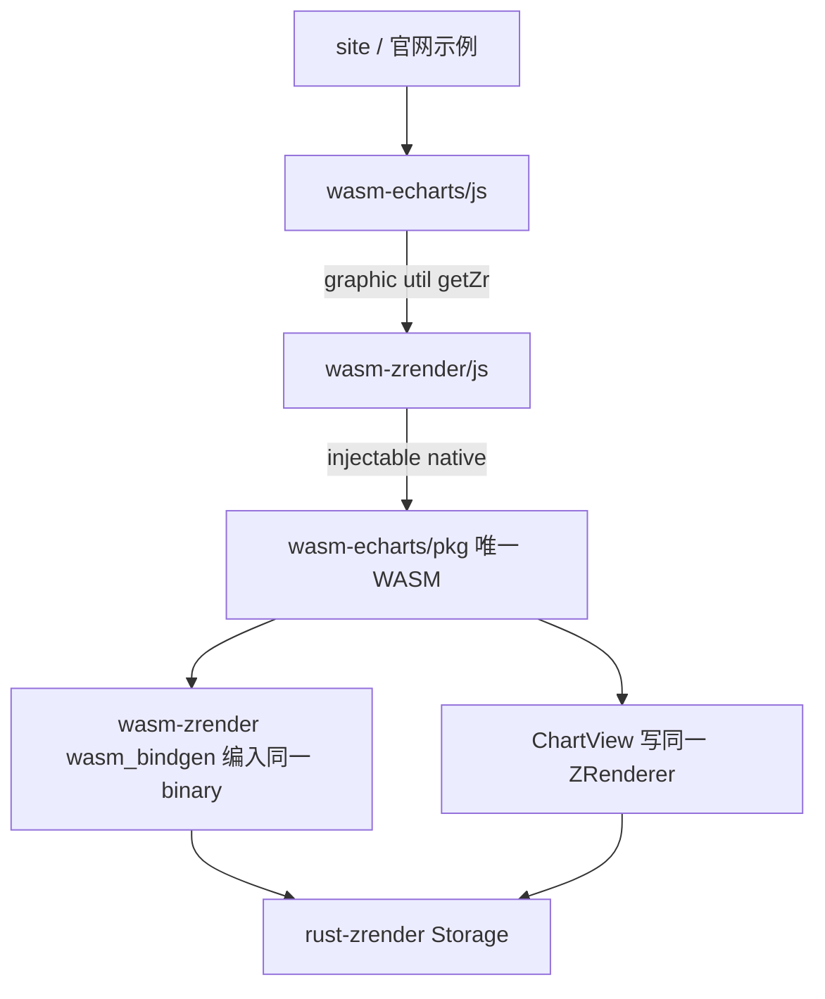

# wasm-echarts Canvas 全量对齐

废弃 [`.cursor/plans/折线缺口补齐_96423c21.plan.md`](.cursor/plans/折线缺口补齐_96423c21.plan.md)（实施时在该文件顶部标明 **废弃**，todos 全部 cancelled）。新权威计划就是本文件。

同时废止 [AGENT.md](AGENT.md) 里「不是一次移植完官方全量 API / feature flag 扩展」以及「本波不挡主路径」里把 `graphic`/`util`/面积/polar/`getZr` 标成后置的写法。

## 新硬规则（写入 AGENT.md）

**仍明确不做**

- SVG painter：`renderToSVGString` / `getSvgDataURL` / `zr.painter.getSvgDom` 不实现。
- 靠 DOM 实现的组件：toolbox **DataView** 浮层、SaveAsImage 的 DOM 下载条。`showLoading`/`hideLoading` **导出**；不播官方旋转 Loading 动画（静态半透明遮罩 + 文案，或空操作，须在文档写清）。
- 动画中间帧：`setOption` / `animate` / UniversalTransition / line grow / ripple **一次写入终态**（你已确认保留）。
- 字体：仍须 `registerFont`。`use(...)` 仍不按需加载（内置模块已编进 WASM）。

**必须做**

- 官方 `export/charts.ts` 22 种图、`export/components.ts` 全部 **canvas** 组件、`src/coord/` 全部坐标系、dataset/transform/stack/encode、`export/api.ts` 命名空间、实例方法里凡是走 canvas / 纯计算的 API。
- Tooltip 维持现有 **string DOM**（官方默认就是 DOM）；补 `trigger: 'axis'` 与 axisPointer 联动。HTMLElement formatter、`renderMode: 'richText'` 可后置，但要出现在「未实现」表而不是当例外永久砍掉。
- 声称支持的图：该图在 canvas 上的 option 族必须生效，禁止再「能 parse、只画直线」。

文档四块（一致 / 不一致 / 非官方 hatch / 已实现未实现）每波同步 [AGENT.md](AGENT.md)、[site/echarts/docs/index.html](wasm-echarts-rs/site/echarts/docs/index.html)、根 README。

禁止改 `echarts-master/`、`zrender-master/`；禁止整文件复制官方实现。

## 架构：getZr 必须共享 Storage

你已选：**放开隔离，echarts JS 可 import wasm-zrender，getZr 返回真实 zrender 实例。**

两个 `wasm-pack` 产物内存不共享。不能 `echarts.init` 画一份、再 `zrender.init` 另一份。必须 **echarts 运行时只加载一份 WASM**。

落地要点：

- [`wasm-echarts/Cargo.toml`](wasm-echarts-rs/crates/wasm-echarts/Cargo.toml) path 依赖 `wasm-zrender`（rlib）。`lib.rs` `pub use` 其 `#[wasm_bindgen]` 类型，使 **一份** `wasm-echarts/pkg` 带上 `ZRender` / 图元绑定。
- [`wasm-zrender/js/native.js`](wasm-echarts-rs/crates/wasm-zrender/js/native.js) 改为可注入：standalone 仍 `import ../pkg/wasm_zrender.js`；echarts 页在 `initWasm` 后 `setNative(echartsPkg)`。zrender 文档站页面继续只用自己的 pkg。
- [`EChartsInstance`](wasm-echarts-rs/crates/wasm-echarts/src/instance.rs) 不再私藏一份与 registry 脱节的 `ZRenderer`。创建引擎后登记进 [`ZR_REGISTRY`](wasm-echarts-rs/crates/wasm-zrender/src/registry.rs)，`getZr()` 返回同一个 JS `ZRender`。
- [`render.rs`](wasm-echarts-rs/crates/wasm-echarts/src/render.rs) 禁止再 `zr.storage = Storage::new()`。ChartView 只重建自己的 root Group（例如 `__ec_chart_root`）；`getZr().add` 的用户图元保留。
- [`echarts.graphic`](echarts-master/src/export/api/graphic.ts) / `util` / `matrix` / `vector` / `color` 从 `@wasm-zrender` 再导出；`time` / `number` / `format` / `helper` 按官方签名在 [`wasm-echarts/js/`](wasm-echarts-rs/crates/wasm-echarts/js/) 重写（官方源只对照）。`LinearGradient` 实例必须能被 `parse_option_value` 收成可枚举字段，供 Rust 读 `type: 'linear'` + `colorStops`。

zrender 文档站与 echarts 文档站可以同时存在两份 WASM；**同一页面里 echarts 不得再加载第二份 zrender wasm。**

## 分波（每波可独立合并）

### 第 0 波：规则落盘

改 AGENT「目标与约束 / 明确不做 / 依赖规则 / 后置清单」。标废弃折线缺口计划。site 文档四块改口径。

### 第 1 波：共享 Zr + 公开命名空间 + 挡脚本的实例 API

- 上一节架构：依赖、native 注入、`getZr`、ChartView 不整树清空。
- JS 导出：`graphic` `util` `number` `time` `format` `helper` `matrix` `vector` `color` `env`。
- 实例：`showLoading`/`hideLoading`（静态或空操作）、`containPixel`、`getDataURL`/`renderToCanvas`（离屏 RGBA → 数据 URL / 画到传入 canvas）、`appendData`、`setTheme`/`registerTheme`、`connect`/`disconnect`（事件/action 转发）、`registerMap`/`getMap` 表结构（本波可不画 map）。
- [`official-runtime.js`](wasm-echarts-rs/site/src/echarts/official-runtime.js) 对已真实导出的命名空间去掉抛错 Proxy。
- 验收：官网折线里因 `graphic.LinearGradient` / `util.each` / `time.format` / `showLoading` / `getZr` 抛错的例子能进入 `setOption`。

### 第 2 波：数据管线与坐标系底座

现在 [`SeriesModel`](wasm-echarts-rs/crates/wasm-echarts/src/model/series.rs) 只有 `Vec<DataPoint>`，无 dataset/encode/stack。按语义重写，不 1:1 抄官方文件：

- `option.dataset` + `source` / `dimensions` / `seriesLayoutBy` / `datasetIndex` / `datasetId` / `encode`
- 内置 transform：`filter` / `sort`；`registerTransform` 接外部
- `stack` / `stackStrategy`（line 与 bar 共用偏移）
- `sampling`（至少 `lttb` / `average`）
- 多 `grid` / `xAxis[]` / `yAxis[]`，按 `gridIndex` / `xAxisIndex` / `yAxisIndex` 取轴
- `AxisType` 补 `time` / `log`；`convertToPixel` finder 扩到这些轴

### 第 3 波：先把已有 4 类图画全（canvas option 族）

对照官方 ChartView，在现有 [`chart/line.rs`](wasm-echarts-rs/crates/wasm-echarts/src/chart/line.rs) 等接线；底层 [`PolylineShape.smooth`](wasm-echarts-rs/crates/rust-zrender/src/graphic/shapes/polyline.rs)、`Polygon`、`FillStrokeStyle::LinearGradient` 已在 rust-zrender。

- **line**：`smooth`/`step`/`connectNulls`/`areaStyle`/`stack`/`sampling`/`endLabel`/`lineStyle.width|type`、value-value 轴用 `x_value`、`coordinateSystem: 'polar'`（依赖第 4 波 polar 可先 cartesian）
- **bar**：`stack`/`barWidth`/`barGap`/`barCategoryGap`/`borderRadius`/`barMinHeight`
- **pie**：`roseType`、label 避让最小集、`selectedMode`
- **scatter**：`large`（终态一次性画完）、其余 symbol

验收：重跑 [`probe-official-line.mjs`](wasm-echarts-rs/site/scripts/probe-official-line.mjs) 对 40 例；视觉缺口写入文档而不是在示例里 workaround。

### 第 4 波：canvas 组件

- legend **点击筛选**、`selected`、orient
- title 完整布局（padding/align）
- markPoint / markLine / markArea
- `option.graphic`（与 getZr 共用图元）
- visualMap continuous / piecewise（控件 + 按 pieces 上色）
- dataZoom **slider**（canvas）+ inside 读 `start`/`end`/`xAxisIndex`
- axisPointer 十字 + label 图元；tooltip `trigger: 'axis'`
- brush、timeline（canvas 滑条，切 option 终态）
- toolbox **canvas 按钮**：`restore` / `magicType` / `dataZoom`；DataView 只 `console.warn`
- thumbnail（canvas 缩略 + roam）

### 第 5 波：其余坐标系

`polar`（angleAxis/radiusAxis）、`radar`、`singleAxis`、`parallel`、`calendar`、`matrix`、`geo`（配合已有 `registerMap` + `parseGeoJSON`）。

### 第 6 波：其余图表（按依赖分批，每批同步官网该类示例）

- polar/雷达族：radar、gauge；line/bar 接 polar
- cartesian 加图：candlestick、boxplot、heatmap、pictorialBar、effectScatter（ripple 只终态）
- 布局图：funnel、chord、sunburst、tree、treemap、graph、sankey、themeRiver
- geo：map、lines
- parallel；calendar/matrix 上的 heatmap/scatter
- **custom**：`renderItem` + `api`（`coord`/`size`/`style`），产出 graphic 进同一 Zr

每图 Cargo feature 可保留，**默认全开**。未接线的 `series.type` 不得再静默 `Other`。

### 第 7 波：扩展注册与 features

`registerPreprocessor` / `Processor` / `Layout` / `Visual` / `Action` / `CoordinateSystem` / `CustomSeries` 做成真表，不再只 `console.warn`。`LabelLayout`、`AxisBreak`、`ScatterJitter` 按 canvas 终态做。`UniversalTransition` 只跳终态并文档标明。`media` 按宽度切 option。

### 第 8 波：文档与验收门禁

- 官网画廊按图类同步（折线已有 [`official-line-catalog.js`](wasm-echarts-rs/site/echarts/examples/official-line-catalog.js)，其它类复用同一套 runtime + probe）。
- 验收：**脚本不因缺 API 抛错** + **iframe 出图** + 文档表与源码一致。不在示例里补齐未实现 API。
- `getZr` 文档写清：返回 wasm-zrender 实例、无 SVG painter / hover layer、动画终态。

## 刻意不进「已对齐」的条目（须出现在未实现/例外表）

- SVG 全套
- DataView DOM、SaveAsImage DOM
- Loading 旋转动画
- 动画中间帧、UniversalTransition 插值
- tooltip HTMLElement formatter / richText 模式（若第 4 波未做完）
- aria 写 `zr.dom` 无障碍属性（非绘制）

## 实施时不要做的事

- 不要让 wasm-echarts 页面同时 init 两份 wasm。
- 不要为了过官网示例去改官方 option 或在 `official-runtime.js` 里假实现。
- 不要把「图类型还没做」写成「canvas 能力后置」；没做的图就标未实现图表，已做的图必须 option 生效。
