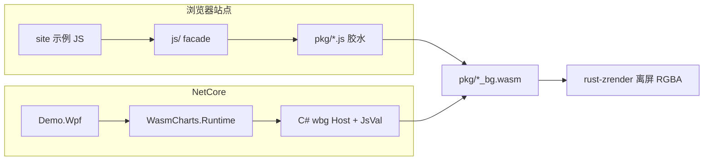

# NetCore 调用 wasm-echarts / wasm-zrender 开发规范

## 0. 结论（先定死，再开工）

### 0.1 UI 框架：WPF（.NET 10 Windows）

三选一结论：**用 WPF，不用 WinForms，不用 WinUI 3。**

- **WinForms**：GDI+ 拼「顶栏 + 左二级菜单 + 右源码/预览」很吃力，没有原生 `WriteableBitmap`，和站点布局差太远。
- **WinUI 3**：需要 Windows App SDK / 打包心智，第三方控件与「教学示例、打开即跑」成本更高；对加载 WASM 没有额外优势。
- **WPF**：XAML 天然对应站点结构（`Grid` 顶栏 / 侧栏 / 右栏二分）；`WriteableBitmap`（`Pbgra32`）可把 WASM 的 RGBA 上屏；`net10.0-windows` 在已安装的 .NET 10 SDK 上一键 `dotnet new wpf`。

运行时库本身用 **`net10.0` 类库**（不绑 UI），控制台 / ASP.NET / 其它桌面都可以复用；只有 Demo 壳是 WPF。

### 0.2 WASM 运行时：Wasmtime（Bytecode Alliance NuGet `Wasmtime`）

三选一结论：**用 Wasmtime 直接实例化 `pkg/*.wasm`，不要用 Wasmer / Blazor / WebView2 / ClearScript 去跑 JS。**

| 方案 | 为何不用 |
|------|----------|
| 只调 `js/` facade | 违反需求 |
| Blazor / WebView2 / ClearScript 执行 `pkg/*.js` | 仍是 JS 宿主，教不会「任意 WASM 环境」 |
| WASI / `componentize-dotnet` | 现有产物是 `wasm32-unknown-unknown` + wasm-bindgen，不是 WASI Component |
| 裸 `WebAssembly` 无宿主 | `set_option` / `Circle` 构造参数是 `externref`（JsValue），模块还导入一整份 `wbg` |

**正确模型**：Wasmtime 加载 **同一份** [`crates/wasm-echarts/pkg/wasm_echarts_bg.wasm`](wasm-echarts-rs/crates/wasm-echarts/pkg/wasm_echarts_bg.wasm) / [`crates/wasm-zrender/pkg/wasm_zrender_bg.wasm`](wasm-echarts-rs/crates/wasm-zrender/pkg/wasm_zrender_bg.wasm)；C# 实现 wasm-bindgen 的 **import 表 + JsVal 堆**；调用导出的 `echartsinstance_new` / `init` / `refresh` 等。运行时 **不执行** `js/` facade，也 **不执行** `pkg/*.js`（后者只作 codegen 的导入表权威，见 §2）。

### 0.3 不改 Rust ABI（默认）

现有 crate 已经能离屏出图：`EChartsInstance::refresh()` / `ZRender::refresh()` 返回 `Vec<u8>` RGBA（`width * height * 4`），不依赖 DOM canvas。option / 图元 opts 走 `JsValue`，由 C# `JsVal` 以 `externref` 喂进去。

**仅当 §4 P0 尖刺失败**（导入过多、canvas start 强依赖 Window 等）才启用备用方案：在 Rust 增加 `set_option_json(&str)` / `element_from_json`，仍产出同一 `pkg` WASM。默认路径不改引擎。

---

## 1. 现有产物约束（必须写进文档）



硬约束：

- echarts 页只加载 **一份** `wasm_echarts_bg.wasm`（内含 zrender 导出）。zrender 画廊只加载 `wasm_zrender_bg.wasm`。禁止双份 WASM。
- 文字必须 `registerFont(bytes, { familyName, sansSerif })`，WASM 不读系统字体。站点字体在 [`site/public/fonts/`](wasm-echarts-rs/site/public/fonts/)（楷体 `simkai.ttf`、雅黑/宋体 ttc；默认 Noto 见 `DEFAULT_FONT_URL`）。Demo **引用该目录，不复制进 git**。
- `refresh()` 是 RGBA，**不是 PNG**。WPF 转 `Pbgra32` 再 `WritePixels`。
- option 里的 **JS function**（`formatter` / `renderItem`）在非 JS 宿主没有 `js_sys::Function`。Runtime 用 C# `JsFunction` 委托实现 `__wbg_call_*`，能覆盖一部分；无法 1:1 执行官网示例里的任意 JS 闭包。bmap / DOM tooltip 等标「宿主不支持」。
- wasm-bindgen 导入名带 hash（如 `__wbg_isArray_145a34fd0a38d7b`），**随 wasm-pack 变化**。必须用 codegen 生成 `WbgImports.g.cs`，禁止手写 hash。

核心 native 导出（来自 [`wasm_echarts_bg.wasm.d.ts`](wasm-echarts-rs/crates/wasm-echarts/pkg/wasm_echarts_bg.wasm.d.ts)）：

- `echartsinstance_new(w, h, dpr)` → ptr
- `echartsinstance_set_option(ptr, optionExternref, optsFlag)`
- `echartsinstance_refresh(ptr)` → `(ptr, len, cap, err)` 形式的 `Result<Vec<u8>>`
- `registerFont(dataPtr, dataLen, optsExternref)`
- zrender：`init` / `circle_new` / `zrender_add` / `zrender_refresh` 等

---

## 2. 仓库落点与工程结构

在 [`wasm-echarts-rs/`](wasm-echarts-rs/) 下新建 `net-core-demo/`（用户指定路径）：

```
wasm-echarts-rs/net-core-demo/
  README.md                      # 本目录唯一入门：环境、dotnet run、与站点 demo 对齐说明
  NetCoreDemo.sln
  Directory.Build.props          # net10.0、可空、隐式 usings
  tools/GenWbgImports/           # 解析 pkg/*.js 的 __wbg_get_imports，生成 WbgImports.g.cs
  src/
    WasmCharts.Runtime/          # net10.0 类库：Wasmtime + JsVal + 两个模块包装
    NetCoreDemo.Wpf/             # net10.0-windows WPF 画廊
```

MSBuild 用 `Link` + `CopyToOutputDirectory` 引用，**不要把 10MB+ wasm 再提交一份**：

- `../../crates/wasm-echarts/pkg/wasm_echarts_bg.wasm`
- `../../crates/wasm-zrender/pkg/wasm_zrender_bg.wasm`
- 字体：`../../site/public/fonts/...`
- echarts 数据：按需链接 `../../site/public/echarts-official/data/...`

NuGet：`Wasmtime`；WPF 源码高亮用 `AvalonEdit`（`ICSharpCode.AvalonEdit`）。不要引入 JavaScript 引擎包。

---

## 3. Runtime 设计（其它 .NET 语言/环境真正要抄的部分）

### 3.1 `JsVal` 堆（替代浏览器 JS 对象）

C# 侧用引用类型表示 wasm-bindgen `externref`：

- `null` / `undefined` / `bool` / `double` / `string`
- `JsArray` / `JsObject`（字典，保持插入序）
- `JsUint8Array`（字体、图片）
- `JsFunction`（C# `Func<JsVal[], JsVal>`，供 formatter）
- `WasmHandle`（包装 `Circle` 等 wasm 类 ptr，对应 JS glue 的 `__wrap`）

Wasmtime `Linker`：开启 reference types；把 guest 对 `wbg.*` 的导入接到上述堆。canvas / `Window` / `getBoundingClientRect` / `putImageData` **全部 stub**（离屏路径不调用 `attachHost`）。

### 3.2 codegen：`tools/GenWbgImports`

1. 读 `pkg/wasm_echarts.js`、`pkg/wasm_zrender.js` 里 `__wbg_get_imports()` 每个 key 的函数体。
2. 按函数体特征分类：`Reflect.get` / `Object.keys` / `Array.isArray` / `instanceof Array` / `Date.now` / `console.error` / `__wbindgen_throw` / `malloc` 已在 exports 等。
3. 生成 `WbgImports.g.cs`：`linker.DefineFunction("wbg", exactHashedName, ...)`。
4. 未知导入 → 生成 `NotImplemented` 并在 P0 列出清单，按需补映射表。

`wasm-pack` 之后必须重跑 codegen（README 写进开发流程）。

### 3.3 高层 C# API（Demo 与文档只展示这一层）

对开发者隐藏 ptr / malloc。示例风格：

```csharp
using var echarts = WasmEchartsModule.Load(wasmPath);
echarts.RegisterFont(File.ReadAllBytes(fontPath), new() {
    FamilyName = "Noto Sans SC",
    SansSerif = ["Noto Sans SC"]
});
using var chart = echarts.Create(640, 400, dpr: 1);
chart.SetOption(JsVal.From(new {
    xAxis = new { type = "category", data = new[] { "Mon", "Tue" } },
    yAxis = new { type = "value" },
    series = new[] { new { type = "line", data = new[] { 150, 230 } } }
}));
byte[] rgba = chart.Refresh();
```

zrender 对位站点 [`hello_world.js`](wasm-echarts-rs/site/zrender/examples/hello_world.js)：`Init(null, opts)` → `new Circle(opts)` → `Add` → `Refresh()`。

内部调用顺序必须与 JS glue 一致：`__wbindgen_start` → 导出函数；`Vec<u8>` 按 wasm-bindgen Result 约定从 linear memory 拷出后 `__wbindgen_free`。

### 3.4 线程与生命周期

- Wasmtime `Store` / 实例 **单线程**。WPF 渲染放 `Task.Run`，回 UI 线程只更新 `WriteableBitmap`。
- 切换 demo 必须 `Dispose` 旧实例（`echartsinstance_dispose` / `zrender.dispose`），避免 ZR_REGISTRY 泄漏。
- 两个产品模块不要共用一个 `Store`（两份 wasm）。

---

## 4. 分阶段实施（规范级任务拆分）

### P0 — 可行性尖刺（阻塞后续一切）

目标：控制台或最小窗口跑通 **无 facade** 路径。

1. `dotnet new classlib -f net10.0` + Wasmtime，实例化 `wasm_echarts_bg.wasm`。
2. 列出全部 import（模块名几乎都是 `wbg`），codegen 第一版。
3. 调用 `echartsinstance_new(320, 200, 1)` → `set_option` 最小折线 → `refresh` → 把 RGBA 写成 BMP/PNG 文件验证像素非空。
4. `registerFont` + 带 `title.text` 的 option，确认不再 `no default font found`。
5. 同样对 `wasm_zrender_bg.wasm`：`init` + `rect_new` + `add` + `refresh`。

验收：两份 wasm 各产出一张可打开的图。失败则启动 §0.3 JSON ABI 备用。

### P1 — WPF 壳（对齐站点交互结构）

对照 [`example-gallery.js`](wasm-echarts-rs/site/src/shared/example-gallery.js) + [`site-header.js`](wasm-echarts-rs/site/src/shared/site-header.js)：

- **顶栏**：两个产品按钮 `wasm-zrender` / `wasm-echarts`（对应站点产品下拉，Demo 里做成一级切换）。
- **左栏**：二级菜单。zrender 扁平 11 项（[`zrender/examples/gallery.js`](wasm-echarts-rs/site/zrender/examples/gallery.js)）。echarts 分组与 [`OFFICIAL_CATEGORY_GROUPS`](wasm-echarts-rs/site/src/echarts/official-gallery-meta.js) + `INTERACTION_EXAMPLES` 一致（综合功能 / 折线 / 柱状 / …）。
- **右栏**：上或左 **AvalonEdit 只读源码**（该 demo 的 C#，不是 JS）；下或右 **`Image` 预览**。错误用醒目文本，不要吞掉。
- 视觉：深色代码区 + 浅灰预览底，参考 [`layout.css`](wasm-echarts-rs/site/src/shared/layout.css) 的 `--code-bg` / `--preview-bg`，不要求像素级抄 CSS。

`DemoCatalog.cs`（或 `demos.json`）的 **id 必须与站点文件名一致**（`hello_world`、`line-simple`…），这是对齐契约。

### P2 — wasm-zrender 全量 11 个 demo

每个示例一个 C# 文件，逻辑对齐 `site/zrender/examples/<id>.js`，但只调 Runtime / pkg 导出：

`hello_world`、`animation`、`bounding_box`、`clip_path`、`glitched_text`、`particles`、`shapes`、`text`、`sector`、`hit`、`state`。

交互类（`hit`、`bounding_box`）：预览 `Image` 上转发鼠标，调用 `findHover` / `handlePointer*`（数值坐标，不绑 canvas）。动画仍是**终态**（与库语义一致）。

### P3 — wasm-echarts 画廊对齐（约 304 个）

不要把 304 个官网 JS 手工翻成 304 套独特管线。分层：

1. **目录生成**：脚本读取 `official-*-catalog.js` + `official-gallery-meta.js`，生成 `EchartsDemoIndex`（id / 中文标题 / 分组 / 能力标签）。
2. **A 类 JSON option**（大多数）：从对应 `.js` 抽出 `option = { ... }`，存 `Options/<id>.json`（或运行时解析）。共享 `EchartsJsonDemo`：`Create` + `RegisterDefaultFont` + `SetOption(json)` + `Refresh`。右栏源码展示这段 C# + option JSON。
3. **B 类 数据文件**：`$.get(ROOT_PATH + ...)` 改为读 `site/public/echarts-official/data/...`，再 `SetOption`。
4. **C 类 回调**：`formatter` / `renderItem` 用 `JsFunction` 按站点语义重写；写不了的标 `NeedsJsCallback`，预览区说明原因，**仍保留菜单项**（对齐，而不是删掉）。
5. **D 类 宿主不可能**：`*-bmap*`、依赖百度地图 / 真实 DOM 的，菜单保留 + `UnsupportedHost`。
6. **E 类 交互**：`interactive`、`merge`、`fonts`、`bench` 手写 C#（`handlePointerClick`、`dispatch_action`、`benchmark_render`）。

P3 可按分组批次合入（先综合功能 + line/bar/pie，再其余 catalog），但 **菜单必须一开始就全量出现**，未移植的显示占位状态，避免和站点目录对不齐。

### P4 — 文档站 + AGENT.md / README

在 [`docs-shell.js`](wasm-echarts-rs/site/src/shared/docs-shell.js) 两边导航 **末尾** 各加一项（不插入现有五章/七章中间，以免打乱硬规则顺序）：

- zrender：`{ id: 'netcore', label: 'NetCore 使用文档', href: '.../zrender/docs/netcore.html' }`
- echarts：同上 → `echarts/docs/netcore.html`

两页都是静态 HTML，模板抄现有 docs（header + docs-layout + `docs-shell.js`）。内容必须包含：

1. 明确：**禁止** `js/` facade；加载的是 `pkg/*_bg.wasm`。
2. 为何是 Wasmtime + C# wbg 宿主（JsValue / externref / 导入 hash）。
3. 最小代码：Load → registerFont → Create/Init → SetOption 或 add 图元 → Refresh → RGBA 上屏。
4. 字体、单实例、echarts 不要再加载 zrender wasm。
5. 函数型 option / bmap 限制。
6. **源码位置**：GitHub 本仓库 [`wasm-echarts-rs/net-core-demo`](wasm-echarts-rs/net-core-demo)（本地 `dotnet run --project src/NetCoreDemo.Wpf`）。
7. 回链 pkg API 页（[`echarts/docs/api/pkg/`](wasm-echarts-rs/site/echarts/docs/api/pkg/index.html)、[`zrender/docs/api/pkg/`](wasm-echarts-rs/site/zrender/docs/api/pkg/)），并写清：浏览器业务仍走 facade；**非 JS 宿主才直接打 pkg wasm**。

同步修改：

- [`AGENT.md`](AGENT.md)：仓库总览加上 `net-core-demo`；zrender 文档硬规则增加第 6 章「NetCore」；echarts 增加第 8 章；架构图补一条非 JS 宿主 → RGBA。
- 根 [`README.md`](README.md) 结构树 + 一句 NetCore 入口。
- `net-core-demo/README.md` 写给克隆仓库的 .NET 开发者。

站点 `vite.config.js` 会扫描全部 html，新页面会自动进 MPA，一般不必改 Vite。

### P5 — 打磨

- `net-core-demo/.gitignore`：`bin/` `obj/` 生成的 `WbgImports.g.cs` 若可复现可不提交；建议 **提交生成结果** 以便无 Node 也能 build。
- Runtime 对 wasm-bindgen Result/throw 转 `WasmHostException`。
- 大图 `bar-large` 等：后台渲染 + 进度/取消，避免 UI 假死。

---

## 5. 文档与 Demo 的「对齐」定义

对齐 = **同一 id、同一分组、同一标题**；实现语言是 C# + pkg wasm，不是把 JS 贴进 WPF。

- 站点预览：iframe 跑 facade。
- NetCore 预览：`refresh()` RGBA。
- 源码区：该 id 的 C#（A 类可同时显示 option JSON）。

每个 echarts id 在目录里带状态：`Ready` / `OptionOnly` / `NeedsCallback` / `UnsupportedHost`。文档里用一张表解释这四种，避免用户以为 304 张图都在桌面端像素级复现官网交互。

---

## 6. 明确不做

- 不把 `js/index.js` 或 `pkg/*.js` 当运行时依赖。
- 不引入 Node、Playwright、WebView 来「借用浏览器画图」。
- 不重编译 WASI / Component Model 第二份 wasm（除非 P0 失败走备用 ABI）。
- 不修改 `echarts-master/`、`zrender-master/`。
- 不在文档里写 probe 计数、波次编号（现有 echarts 文档硬规则）。

---

## 7. 建议本地验证（实现阶段）

- `dotnet build` / `dotnet run --project src/NetCoreDemo.Wpf`
- P0：两份 wasm 出图文件
- 手动点：zrender `hello_world` / `text` / `hit`；echarts `line-simple` / `fonts` / 一个 `NeedsCallback` 占位
- `npm run dev` 打开新文档页，确认侧栏高亮与移动端折叠仍正常
