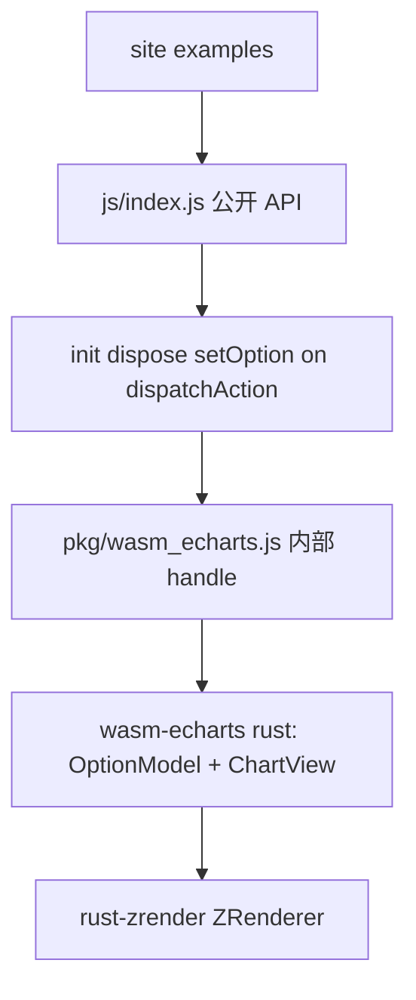

# wasm-echarts API 规范与补齐

对照源（只读，禁止改）：[`echarts-master/src/core/echarts.ts`](echarts-master/src/core/echarts.ts)、[`echarts-master/src/export/core.ts`](echarts-master/src/export/core.ts)、[`echarts-master/src/export/api.ts`](echarts-master/src/export/api.ts)。禁止整文件复制官方实现。

当前公开入口是 wasm-bindgen 直出 [`EChartsInstance`](wasm-echarts-rs/crates/wasm-echarts/src/instance.rs)，site 这样用：

```javascript
import initWasm, { EChartsInstance } from '@wasm-echarts';
await initWasm();
const chart = new EChartsInstance(480, 360, 1);
chart.set_option({ ... });
const rgba = chart.refresh();
```

官方是：

```javascript
import * as echarts from 'echarts';
const chart = echarts.init(dom, theme?, opts?);
chart.setOption(option, notMerge?, lazyUpdate?);
chart.on('click', handler);
echarts.dispose(chart);
```

差距主要在 **公开 JS 表面**，不是「四个图表完全不能画」。line/bar/pie/scatter 的 option **形态**已经接近官方，但调用方式、方法名、第二参数、事件总线都未对齐。



---

## 规范（先写入 AGENT.md）

对齐 wasm-zrender 的写法：例外写死、必须一致可核对、后置项不混进「已对齐」。

**允许例外（仅此五条）：**

- 字体：WASM 不读系统字体；需要 `registerFont`（可挂在 echarts 命名空间，或文档写明走 rust-zrender 全局字体表）。
- 动画：不播中间帧；`setOption` / `animation` 直接终态。`lazyUpdate` 可同步执行（等价立刻 flush）。
- 离屏：仅 canvas；`refresh()` 仍可作内部/逃逸 hatch 返回 RGBA。`init(canvas)` 自动 `putImageData`。无 SVG（`renderToSVGString` / `getSvgDataURL` 不实现）。
- 宿主：`init(canvas, theme?, opts?)`；`init(null, null, { width, height, devicePixelRatio })` 允许离屏（官方客户端 `init` 无 dom 会抛错，这是 WASM 例外）。
- 扩展系统不做：`use` / `registerPreprocessor` / `registerProcessor` / `registerLayout` / `registerVisual` / `registerCoordinateSystem` / `registerCustomSeries` / `extend*Model` 本波只做空实现或明确未导出。`getZr()` 因 crate 隔离（wasm-echarts 不依赖 wasm-zrender）本波不导出。

**必须一致：**

- 公开入口与官方同构：`init` / `dispose` / `getInstanceByDom` / `getInstanceById` / `version`（`'6.1.0'`）。
- 实例方法 camelCase，签名对齐：`setOption` / `getOption` / `resize` / `dispatchAction` / `on` / `off` / `getWidth` / `getHeight` / `getDevicePixelRatio` / `isDisposed` / `clear` / `dispose`。
- `setOption(option)` 与 `setOption(option, notMerge)` / `setOption(option, { notMerge, replaceMerge, silent })`。`notMerge` **不是** option 里的字段（当前 [`option/mod.rs`](wasm-echarts-rs/crates/wasm-echarts/src/option/mod.rs) 从 option 根上剥 `notMerge`，这是错的）。
- `resize()` 无参（读 canvas 尺寸）与 `resize({ width, height, devicePixelRatio })`。
- `init(canvas)` 后指针事件由 facade 绑定，用户不再手写 `handle_pointer_move`；发出官方事件名 `click` / `mouseover` / `mouseout` / `globalout`。
- 已接线的 `dispatchAction` type 名保持官方字符串：`highlight` / `downplay` / `select` / `unselect` / `toggleSelect` / `dataZoom`；并补 `showTip` / `hideTip`。

**本波不挡主路径（后置，不混进「已对齐」）：** `connect`/`disconnect`、`setTheme`/`registerTheme`、`registerMap`、`appendData`、`convertToPixel` 完整 finder、`getDataURL`/`renderToCanvas`、`showLoading`、`graphic`/`util`/`number`/`format` 命名空间、polar/gauge/其余 chart、legend 绘制、media query、完整 SeriesData、`getZr()`。

---

## 清单一：公开 JS API（相对 `core/echarts.ts`）

### 模块级

| 官方 | wasm-echarts 现状 | 判定 |
|------|-------------------|------|
| `init(dom, theme?, opts?)` | 无；`new EChartsInstance(w, h, dpr)` | 不一致 |
| `dispose(chart \| dom \| id)` | 仅实例 `dispose()`，无模块函数、无实例表 | 不一致 |
| `getInstanceByDom` / `getInstanceById` | 无 | 不一致 |
| `version` / `dependencies` | 无 | 不一致 |
| `connect` / `disconnect` | 无 | 后置 |
| `registerTheme` / `registerMap` / `getMap` / `registerLocale` | 无 | 后置 |
| `use` / `registerAction` / `registerPreprocessor` / `registerProcessor` / `registerLayout` / `registerVisual` / `registerLoading` / `registerCoordinateSystem` / `registerCustomSeries` / `registerTransform` | 无 | 后置（扩展系统） |
| `setPlatformAPI` / `setCanvasCreator` | 无 | 后置；离屏不创建 DOM canvas |
| `PRIORITY` / `dataTool` | 无 | 后置 |
| `export/api.ts`：`graphic` `util` `number` `time` `format` `helper` `matrix` `vector` `color` `env` `parseGeoJSON` `Model` `ChartView`… | 无 | 后置（工具/扩展） |

### 实例方法

| 官方 | wasm-echarts 现状 | 判定 |
|------|-------------------|------|
| `setOption(opt, notMerge?, lazyUpdate?)` 或 opts 对象 | `set_option(opt)`；把 `notMerge` 当 option 字段剥掉 | 名字与签名都不一致 |
| `getOption()` | 无 | 不一致 |
| `resize(opts?)` | `resize(w, h, dpr)` 三位置参数 | 不一致 |
| `getWidth` / `getHeight` / `getDevicePixelRatio` | `width()` / `height()` / `dpr()` | 语义近、名字不一致 |
| `dispatchAction(payload, opt?)` | `dispatch_action`；已实现 6 个 type，其余 `console.warn`；无 silent/flush | 部分一致 |
| `on` / `off` / `trigger`（Eventful） | 无；交互靠 `handle_pointer_move` 返回值 | 不一致 |
| `clear` / `isDisposed` / `dispose` | 仅 `dispose`（不清 Storage / 无 disposed 标志） | 部分 |
| `getDom` / `getId` / `group` | 无 | 不一致（init 后应有） |
| `convertToPixel` / `convertFromPixel` / `containPixel` / `convertToLayout` | 无 | 后置（cartesian 可先做最小版） |
| `getVisual` | 无 | 后置 |
| `appendData` | 无 | 后置 |
| `setTheme` | 无 | 后置 |
| `showLoading` / `hideLoading` | 无 | 明确不做（DOM） |
| `getDataURL` / `getConnectedDataURL` / `renderToCanvas` / `renderToSVGString` | 无；有内部 `refresh()`→RGBA | `refresh` 作例外 hatch；DataURL 后置 |
| `getZr` / `isSSR` / `updateLabelLayout` / `makeActionFromEvent` | 无 | 后置 / 不做 SSR |

### 当前多出来的非官方 API（facade 内收，不要作为公开主表面）

[`instance.rs`](wasm-echarts-rs/crates/wasm-echarts/src/instance.rs)：`refresh`、`find_hover`、`handle_pointer_move`、`handle_pointer_leave`、`apply_data_zoom_wheel`、`get_tooltip_content`、`benchmark_render`、`has_option`、`option_has_functions`。

这些可以继续作为 **native 内部方法**；facade 的 `init(canvas)` 消化指针与上屏。`benchmark_render` 可留在文档/bench 示例里从 native 调，或挂 `echarts.__native`。

---

## 清单二：option / 图表 / 交互（相对官方 option 与 `export/charts.ts`）

「能 parse 进来」≠「按官方语义生效」。下面按 **生效程度**。

### 已接近官方形态（部分生效）

- **入口 option 树**：任意 JSON + 函数字段可进 [`OptionValue`](wasm-echarts-rs/crates/wasm-echarts/src/option/parse.rs)（这点与官方「option 含 formatter 函数」一致）。
- **深合并**：对象深合并、数组按 index 合；函数覆盖。缺官方 `replaceMerge` 真正按 component `id` 替换、缺 `notMerge` 第二参数。
- **series.type**：`line` / `bar` / `pie` / `scatter`（feature flag 与官方 chart install 对应，但是写死在 rust，不是 `echarts.use(BarChart)`）。
- **cartesian**：单 `xAxis`/`yAxis`；`type: category | value`；`grid.left/right/top/bottom`。
- **line**：Polyline + 固定半径 Circle 符号；`itemStyle.color` / `lineStyle.color` 可为函数。
- **bar**：Rect，带宽 0.6。
- **pie**：Sector；默认 startAngle 90°、顺时针（与官方默认一致）；半径由 grid 推，不是 `radius`/`center`。
- **scatter**：双 value 轴；固定 `symbolSize` 6。
- **tooltip.formatter**：返回 **string** 时可用；[`CallbackDataParams`](echarts-master/src/util/types.ts) 目前只有 `seriesIndex/dataIndex/seriesName/name/value/color`，缺 `componentType`、`percent`、`data`、`encode`、`$vars` 等。
- **emphasis/select**：图元 state patch + `dispatchAction` 六个 type。
- **dataZoom**：option 里 `type: 'inside'` 时滚轮改 start/end **百分比窗口**；无 slider UI、无 `startValue`/`endValue`/`xAxisIndex` 完整语义。
- **axisPointer**：option 开启时画 **竖线**；无十字、无 label 浮层、无 `trigger: 'axis'` tooltip。

### 名字在 option 里出现但未按官方做

- `setOption` 的 `notMerge` / `lazyUpdate` / `replaceMerge` / `transition`：被当 option 字段 `strip_meta_keys`，官方它们是 **第二参数**。
- `axisLabel.formatter`：bridge 有 resolve，轴渲染仍用类目/数值字符串。
- `series.label` / `labelLine`：`resolve_label` 有，图元未画。
- `symbol` / `symbolSize`：忽略，line/scatter 写死圆。
- pie：`radius` / `center` / `roseType` / `startAngle` / `clockwise` / `label` 未读。
- `tooltip.trigger: 'axis'`、HTMLElement formatter、`confine`、`position`。
- `color` 色板：只用默认色 + itemStyle，不是官方 palette 全套。
- 多 `grid` / 双 y 轴 / `xAxis: []` 数组。

### 官方有、本 crate 完全没有（后置）

**Charts**（[`export/charts.ts`](echarts-master/src/export/charts.ts)）：Radar、Map、Tree、Treemap、Graph、Chord、Gauge、Funnel、Parallel、Sankey、Boxplot、Candlestick、EffectScatter、Lines、Heatmap、PictorialBar、ThemeRiver、Sunburst、Custom（`renderItem`+`api`）。

**Components**（[`export/components.ts`](echarts-master/src/export/components.ts)）：legend（含绘制与 `legendToggleSelect`）、title、toolbox、visualMap、geo、polar、radar、singleAxis、calendar、graphic、brush、timeline、markPoint/Line/Area、dataset/transform、aria、thumbnail。grid 只有边距矩形，不是完整 Grid 组件。

**Actions 未接**：`showTip`/`hideTip`、legend\*、restore、brush、timeline、geo roam、pie 选中联动等。

---

## 补齐架构：JS facade（与 wasm-zrender 同一套路）

新建 [`wasm-echarts-rs/crates/wasm-echarts/js/`](wasm-echarts-rs/crates/wasm-echarts/js/)：

- `index.js`：官方核心命名导出；`default` 仍是 wasm-bindgen `initWasm`。
- `echarts.js`：`init` / `dispose` / `getInstanceByDom` / `getInstanceById` / `version`；实例表。
- `instance.js`：包装 native `EChartsInstance`；camelCase；Eventful 风格 `on`/`off`；`init(canvas)` 绑 pointer + 自动 `putImageData`；wheel → 内部 `apply_data_zoom_wheel`。
- 兼容：可再 `export { EChartsInstance }` 以免旧示例立刻碎，但文档与 site **改走官方写法**。

[`site/vite.config.js`](wasm-echarts-rs/site/vite.config.js) 的 `@wasm-echarts` 改为指向 `js/`（同 zrender）。native 仍是 `pkg/`。

Rust 侧用 `js_name` 或保留 snake_case 给 native、由 facade 翻译均可；**不要**让 site 继续依赖 `set_option`。

---

## 逐项波次

每波：改 rust（若需要）→ facade → 改 site 示例 → 更新 AGENT.md。做完一波再开下一波。

### 波次 0 — 规范落盘

把上节写入 [`AGENT.md`](AGENT.md)「目标与约束」和「三、wasm-echarts」；本计划作为逐项清单。改掉「只有 EChartsInstance」的过时用法说明。

### 波次 1 — facade 骨架 + 入口

- `init` / `dispose` / `getInstanceByDom` / `getInstanceById` / `version`。
- 实例：`setOption`→native `set_option`，`resize`/`getWidth`/`getHeight`/`dispose` 转调。
- `init(canvas)` 自动上屏（与 zrender 相同例外）。
- site：[`bar.js`](wasm-echarts-rs/site/echarts/examples/bar.js) 等改为官方写法；临时可内部仍 `refresh` 一次以验证。

### 波次 2 — `setOption` / `resize` 签名

- `setOption(option, notMerge | opts)`；停止从 option 根读取 `notMerge`。
- `getOption()`：把 `OptionValue` 转回普通 JSON（函数字段可省略或保留为原 Function）。
- `resize()` / `resize({ width, height, devicePixelRatio })`；有 canvas 时无参读 `clientWidth/Height`。
- `clear` = `setOption({ series: [] }, true)`；`isDisposed`。
- `replaceMerge` 最小：顶层 key 整段替换（比官方按 id 弱，文档标明）。

### 波次 3 — 事件 + 指针（消化非官方方法）

- facade `on`/`off`：`click`、`mouseover`、`mouseout`、`globalout`。
- `init(canvas)`：mousemove/click/leave/wheel 全部进 facade；payload 尽量像官方 `ECElementEvent`（`event`、`seriesIndex`、`dataIndex`）。
- tooltip：facade 内建简单 DOM（string HTML），用户不必再抄 [`interactive.js`](wasm-echarts-rs/site/echarts/examples/interactive.js) 那套 `handle_pointer_move`。HTMLElement formatter 仍后置。
- `dispatchAction({ type: 'showTip' | 'hideTip', seriesIndex, dataIndex })`。

### 波次 4 — 已支持图表的 option 语义（画出来就错的字段）

只补 **当前 4 类图**，不新开 chart 类型：

- 轴：`axisLabel.formatter` 真正进 Text。
- pie：`center` / `radius` / `startAngle` / `clockwise` / `r0`（环形）。
- line/scatter：`symbol`（circle/rect/emptyCircle 先做）与 `symbolSize`（数或函数）。
- series `label.show` + formatter 画出 Text；pie `labelLine` 可再下一小步。
- `CallbackDataParams` 补 `componentType`/`seriesType`/`percent`（pie）/`data`。
- cartesian：`convertToPixel` / `convertFromPixel` 的 `xAxis`/`yAxis`/`grid` finder 最小集。

### 波次 5 — 文档与验收

- [`site/echarts/docs/index.html`](wasm-echarts-rs/site/echarts/docs/index.html)、根 README、AGENT.md 全部改成 `echarts.init`。
- 示例：line/bar/pie/scatter/interactive/merge/bench 走 facade；interactive 不再调用 `handle_pointer_*`。
- 手工：`init(canvas)` 出图、二次 `setOption` 合并、`notMerge: true`、click `on`、`dispatchAction('toggleSelect')`、wheel dataZoom、dispose 后再 init。

### 明确仍后置（不进本计划验收）

legend / title / polar / gauge / 面积图 / Custom `renderItem` / media / SeriesData 全管道 / `getZr` / `connect` / 主题 / `getDataURL` / Loading / 其余 20 种 chart。需要时另开计划，与「API 已对齐」分开说。
