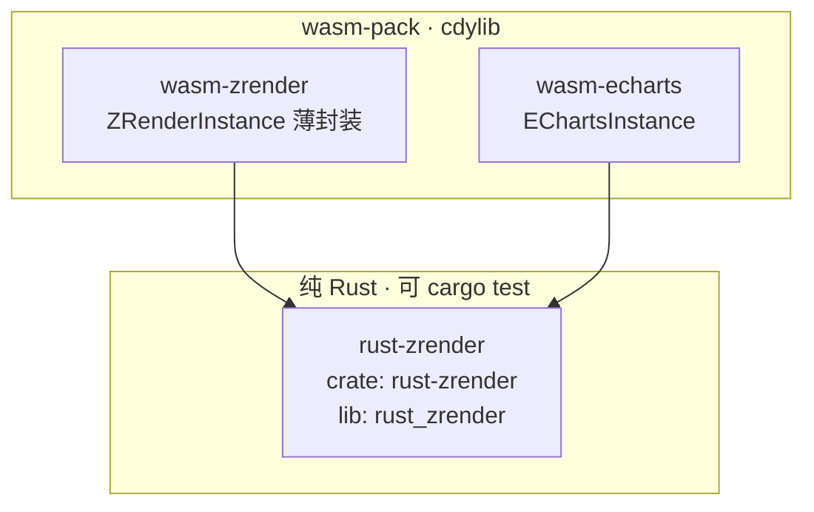
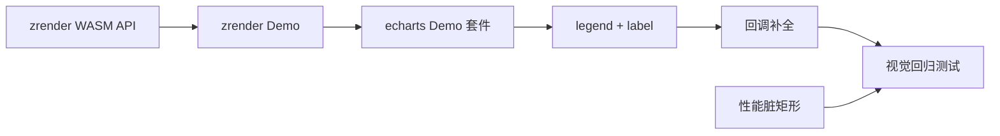

# wasm-echarts 待办与 Demo 规划

> **关联文档**：[wasm-echarts_移植规划_692fb54c.plan.md](wasm-echarts_移植规划_692fb54c.plan.md)（总规划，阶段 0–7 设计说明）  
> **代码现状**：阶段 0–6 主体已落地，阶段 7 完成 pie/scatter/轴标签/基础 Text/benchmark 初版；**Crate 已拆分为 rust-zrender + wasm-zrender + wasm-echarts**（见下节）。

---

## Crate 架构规范（已落地）

三层依赖关系：**底层纯 Rust lib** + **两个 wasm-bindgen WASM 产物**，彼此 sibling，不互相依赖。



| Crate | 路径 | 类型 | 职责 |
|-------|------|------|------|
| **rust-zrender** | `crates/rust-zrender/` | 普通 `rlib` | Storage / Painter / Handler / 图元 / vl-convert 后端；**无 wasm-bindgen** |
| **wasm-zrender** | `crates/wasm-zrender/` | `cdylib` + `rlib` | 薄封装 `ZRenderInstance`：`load_scene` / `refresh` / `find_hover` / `resize`；供 zrender 级 Demo |
| **wasm-echarts** | `crates/wasm-echarts/` | `cdylib` + `rlib` | `EChartsInstance` + option 管线；内部直接使用 `rust_zrender::ZRenderer` |

**依赖规则**：

- `wasm-echarts` → `rust-zrender`（**不**依赖 `wasm-zrender`）
- `wasm-zrender` → `rust-zrender`
- 浏览器集成：`demo/` 分别 `import` 各 crate 的 `pkg/wasm_*.js`

**编译命令**：

```bash
cd wasm-echarts-rs/crates/wasm-zrender && wasm-pack build --target web
cd wasm-echarts-rs/crates/wasm-echarts && wasm-pack build --target web
cd wasm-echarts-rs && cargo test -p rust-zrender
```

**Rust 引用约定**：代码中 `use rust_zrender::...`；npm/pkg 名仍为 `wasm-zrender` / `wasm-echarts`。

---

## 已完成摘要（不再重复开发）

| 阶段 | 已完成能力 |
|------|-----------|
| 0 | crate 结构、vl-convert 后端、`CanvasBackend` trait、`demo/` 目录 |
| 1 | Storage / Path / Painter / brush、基础 shape、单元测试 RGBA 输出 |
| 2（部分） | shadow pass、isPointInPath、径向渐变 r0、Linear/Radial/Pattern、lineDash、Image |
| 3 | Handler.findHover、ECData、emphasis/select 状态 |
| 4 | JS 薄壳、`OptionValue` 解析合并、`EChartsInstance` WASM API |
| 4b（部分） | `CallbackDataParams`、`formatter`/`color` 回调、`resolve_formatter` |
| 5（部分） | GlobalModel、cartesian、line/bar ChartView、Scheduler 单次全量 |
| 6（部分） | hover 高亮、toggleSelect、tooltip string、wheel dataZoom、axisPointer 竖线 |
| 7（部分） | pie/scatter、轴刻度 Text、feature flags、`benchmark_render` |
| 架构 | **rust-zrender / wasm-zrender / wasm-echarts** 三 crate 拆分 |

---

## 一、rust-zrender / wasm-zrender 待办

### 1.1 rust-zrender 后端与图元能力缺口

| 项 | 规划来源 | 现状 | 待办 |
|----|----------|------|------|
| conic gradient | 阶段 2 | 未实现 | 线性/径向近似或 tiny-skia 直绘 |
| CSS filter | 阶段 2 | 忽略 | 文档化不支持；按需评估 |
| Text 场景图 | 阶段 7 | 仅 `Storage.texts` 平铺列表，未进 Group/displayList | 纳入 `ChildRef::Text`、z 排序、transform |
| Text 命中检测 | 阶段 3 | 未做 | `measure_text` + bbox contain（轴标签可 silent） |
| 字体资源 | 风险缓解 | 使用 vl-convert 默认字体 | JS 预加载 font bytes → `fontdb` 共享 |
| strokeText | 阶段 7 | 未暴露 | 按需封装 `CanvasContext::stroke_text` |

### 1.2 wasm-zrender WASM 薄封装（阶段 3 规划）

**已完成**（`crates/wasm-zrender/`）：

- [x] 独立 `wasm-pack` crate（`cdylib`）
- [x] `ZRenderInstance`：`new` / `load_scene` / `refresh` / `find_hover` / `resize` / `highlight_path`
- [x] 内置场景：`shapes` | `text` | `sector` | `hit` | `state`
- [x] 与 `wasm-echarts` 解耦（均只依赖 `rust-zrender`）

**待办**（动态构图 API）：

```rust
// 目标扩展（示意）
impl ZRenderInstance {
    pub fn add_path(...) -> u32;
    pub fn add_text(...) -> u32;
    pub fn clear_scene(&mut self);
}
```

- [ ] 暴露 `add_path` / `add_text` / `add_group` 等增量 API（当前仅 `load_scene` 预设场景）
- [ ] `demo/zrender/` 浏览器 Demo 页对接 `wasm-zrender/pkg`

### 1.3 性能（阶段 7）

- [ ] 脏矩形（`useDirtyRect`）：displayList 局部 brush + `DirtyRect` 局部回写
- [ ] 多 zlevel Layer 已初步支持，需与脏矩形联调
- [ ] 离屏 Worker 渲染（可选，依赖 Demo 与 JS 薄壳设计）

---

## 二、wasm-echarts 待办

### 2.1 Option / 回调桥接（阶段 4b）

| 回调/能力 | 现状 | 待办 |
|-----------|------|------|
| `label.formatter` | 已解析，**未绘制 label** | visual 阶段调用 + Text/RichText 输出 |
| `axisLabel.formatter` | `resolve_axis_formatter` 存在，**轴渲染未调用** | 接入 `chart/axis.rs` |
| `symbol` / `symbolSize` | 未实现 | 折线/散点动态符号 |
| `series.renderItem` | `call_render_item` 存在，**无 CustomView** | 实现 `api` 对象子集 + graphicSpec → zrender |
| `tooltip.formatter` → HTMLElement | 仅 string | JS 薄壳检测 DOM 返回值并挂载 |
| formatter/color 缓存 | 无 | per-series 常量结果缓存 |
| `CallbackDataParams` 字段 | 最小子集 | 补 `percent`、`dimensionNames`、`encode` 等 |

### 2.2 核心模型与管线（阶段 5）

| 模块 | 现状 | 待办 |
|------|------|------|
| `OptionManager` / media query | 仅 deep merge | `media` 条件解析与切换 |
| `SeriesData` / `Source` | 简化 `DataPoint`  vec | 维度、encode、layout 管道 |
| `restoreData` / `dataProcessor` | 无 | 按 MVP 裁剪移植 |
| 面积图 `areaStyle` | 无 | line series 下 Polygon 填充 |
| 多 grid / 多 x/yAxis | 单轴 | 多组件 index 映射 |
| `lazyUpdate` / `replaceMerge` | 部分 meta 字段 | 完整 setOption 语义 |

### 2.3 组件（阶段 5 P1–P2、阶段 6）

| 组件 | 现状 | 待办 |
|------|------|------|
| legend | 未绘制 | LegendView → Text + 色块 hit |
| dataZoom slider | 仅 inside + wheel | 滑块 UI（WASM 或 JS 控件）+ extent 同步 |
| dataZoom pinch | 无 | touch 双指 → `apply_data_zoom` |
| tooltip | string + DOM 定位 | 富文本/HTML、confine、trigger: axis |
| axisPointer | 单竖线 | 十字线、多轴联动、label 背景 |
| dispatchAction | highlight/downplay/select/dataZoom | `showTip`/`hideTip`、`legendToggleSelect` 等 |

### 2.4 图表扩展（阶段 7）

| 类型 | 现状 | 待办 |
|------|------|------|
| pie | 基础扇区 | `radius`/`center` option、roseType、label 引导线 |
| scatter | 基础圆点 | 大号数据、symbol 回调 |
| gauge | 无 | 仪表盘 MVP |
| polar | 无 | 极坐标 + line/bar |
| 组合图 | 单 series 类型分派 | 同图 line+bar、双 y 轴 |

### 2.5 文本与样式（阶段 7）

- [ ] RichText / TSpan（参考 [zrender-master/src/graphic/Text.ts](e:\wasm-echarts\zrender-master\src\graphic\Text.ts)）
- [ ] series `label` / `labelLine` 布局
- [ ] `itemStyle` 渐变对象从 JS 回调解析

### 2.6 性能与体积

- [ ] 脏矩形与 echarts `render` 增量结合
- [ ] WASM 体积：按 chart feature 裁剪默认 feature 集
- [ ] 大数据量：跳过逐点 formatter（batch 或采样）

---

## 三、测试体系待办（阶段 7）

| 类型 | 现状 | 待办 |
|------|------|------|
| Rust 单元测试 | 24 项（几何/merge/zoom/pie） | 补 legend layout、renderItem 解析、coord 极坐标 |
| 浏览器集成测试 | `tests/web.rs` 空 | wasm-bindgen-test 注入 function option |
| 视觉回归 | 无 | 选 echarts `test/*.html` → option JSON → golden PNG diff |
| 性能基准 | `benchmark_render` + `?bench=1` | 固定用例集；输出 JS ECharts vs WASM 对比表 |
| vl-convert 差异 | 无文档 | 差异项清单 + 容忍阈值 |

---

## 四、Demo 建设（新增任务）

当前 [wasm-echarts-rs/demo/](e:\wasm-echarts\wasm-echarts-rs\demo) 为 **echarts 合一页**；`wasm-zrender` 已有独立 crate 与 `ZRenderInstance`，**浏览器 Demo 页待建**。

### 4.1 wasm-zrender Demo

**目标**：`wasm-pack build -p wasm-zrender` 后在浏览器验证底层渲染。

**建议目录**：

```
wasm-echarts-rs/demo/zrender/
├── index.html
├── main.js
└── js/zrender.js          # import ../../crates/wasm-zrender/pkg/wasm_zrender.js
```

**建议场景（分页或 URL 参数）**：

| 场景 | 验证点 |
|------|--------|
| `?scene=shapes` | Rect/Circle/Line/Polygon/渐变/虚线/阴影（对齐 `render_demo_shapes`） |
| `?scene=text` | fillText、对齐/基线、中文渲染 |
| `?scene=sector` | 饼图扇区 SectorShape |
| `?scene=hit` | find_hover + ECData 回显 |
| `?scene=state` | emphasis/select 切换 |

**依赖**：`crates/wasm-zrender`（`ZRenderInstance.load_scene`）。

**验收**：

- [ ] `wasm-pack build` 于 `crates/wasm-zrender`
- [ ] `http-server` 下打开 `demo/zrender/` 可见图形
- [ ] README 补充 zrender Demo 与双 crate 编译说明

### 4.2 wasm-echarts Demo 套件

**目标**：覆盖 echarts 对外 API 与主要图表/交互，便于手工回归与对外展示。

**建议结构**：

```
wasm-echarts-rs/demo/
├── index.html              # 导航 hub
├── echarts/                # 现有 demo 迁入或保留
│   ├── index.html
│   ├── main.js
│   └── js/echarts.js
├── cases/                  # 静态 option JSON（可选）
│   ├── line.json
│   ├── bar.json
│   ├── pie.json
│   └── scatter-function.json
└── bench/
    └── index.html          # 基准对比页（WASM vs 官方 echarts，可选）
```

**建议页面/用例**：

| 用例 | URL 示例 | 验证点 |
|------|----------|--------|
| 折线 + 函数 formatter | `?type=line` | 已有，补 label 显示后回归 |
| 柱状 | `?type=bar` | 已有 |
| 饼图 | `?type=pie` | 已有，补 label 后回归 |
| 散点 | `?type=scatter` | 已有 |
| 交互合集 | `?type=line&interactive=1` | hover/select/dataZoom/axisPointer/tooltip |
| 函数 option | `?case=function` | color/formatter/tooltip 回调 |
| 基准 | `?bench=1` | 已有，扩展多 chart 报告 |
| setOption 合并 | `?case=merge` | notMerge / 二次 setOption |

**验收**：

- [ ] Hub 页列出所有 Demo 入口
- [ ] 每个 chart type 至少一个可运行 HTML
- [ ] README Demo 章节与目录一致
- [ ] （可选）与官方 echarts 同 option 截图对比说明

---

## 五、推荐实施顺序



1. **Demo 基础设施**（zrender WASM + zrender Demo + echarts Demo hub）— 降低后续调试成本  
2. **组件与文本**（legend、label、axisLabel.formatter）— 提升图表可读性  
3. **回调与 CustomSeries 子集**（renderItem）— 对齐官方 option 兼容目标  
4. **交互补全**（pinch、showTip、axis 模式 tooltip）  
5. **图表扩展**（gauge、polar、area）  
6. **性能 + 视觉回归 + 基准报告**

---

## 六、任务与规划阶段对照

| 本文件 todo id | 对应原规划 |
|----------------|-----------|
| （架构） | rust-zrender + wasm-zrender + wasm-echarts 三 crate |
| `demo-zrender` | 阶段 0 JS demo + wasm-zrender pkg |
| `demo-echarts` | 阶段 0/4 JS 薄壳 + 阶段 7 基准 |
| `zrender-wasm-api` | 阶段 3 § WASM 导出（基础已完成，add_element 待补） |
| `zrender-backend-gaps` | 阶段 2 缺口 + 阶段 7 Text（rust-zrender） |
| `echarts-callback-full` | 阶段 4b 全文 |
| `echarts-model-pipeline` | 阶段 5 Global/SeriesData/Scheduler |
| `echarts-components` | 阶段 5 P1–P2 + 阶段 6 |
| `echarts-charts-expand` | 阶段 5 P3 + 阶段 7 |
| `echarts-interaction-gaps` | 阶段 6 未覆盖项 |
| `echarts-text-richtext` | 阶段 7 文本 |
| `echarts-performance` | 阶段 7 性能 + 风险缓解 |
| `testing-visual` | 阶段 7 测试体系 |

---

## 七、Out of Scope（明确不做）

- SVG 渲染模式
- 动画中间帧 / morph
- Loading、DataView 等 DOM 组件
- 完整 echarts 全量移植（严格 MVP + feature flag 扩展）
