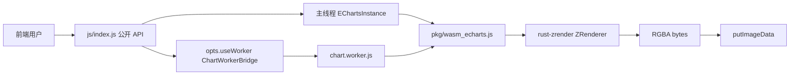

# wasm-echarts 多页文档重构

## 现状

权威文档仍是一张长页：[wasm-echarts-rs/site/echarts/docs/index.html](wasm-echarts-rs/site/echarts/docs/index.html)，把快速开始、公开 API、例外、非官方 hatch、已实现/未实现、函数 option、实例对照全堆在一起。文里还夹着 **probe 验收报表**（296/281、timeout、第 8.9 波），那是迁移官网示例时的内部手段，**开发者用库时碰不到，公开文档一律不写**。

站点已是 Vite MPA（[vite.config.js](wasm-echarts-rs/site/vite.config.js) 自动收集 HTML）。首页起因 + 三层定位、全站顶栏已在 [wasm-zrender 文档重构](.cursor/plans/wasm-zrender_文档重构_d64ac165.plan.md) 落地，**本波不改首页结构**。

公开入口是 `@wasm-echarts` → [crates/wasm-echarts/js/index.js](wasm-echarts-rs/crates/wasm-echarts/js/index.js)；`pkg/` 的 `EChartsInstance` 是内部 handle。文档以 facade 为默认用法，pkg 单独成章。

侧栏复用现有 [docs-shell.js](wasm-echarts-rs/site/src/shared/docs-shell.js)：按路径区分产品（`/echarts/docs` vs `/zrender/docs`），kicker / `DOC_NAV` / 徽章说明文案按产品切换。echarts 页仍 `import docs-shell.js`，不必第二套布局。

## wasm-echarts 文档信息架构

`/echarts/docs/` 默认落在「快速上手」。左侧固定菜单，当前页高亮。相对 zrender 五章，**多一章「运行模式」**（主线程 / Worker）；echarts 特有的能力表单独成「已实现 / 未实现」，不塞进差异页。

```
快速上手
字体引用
运行模式
API 参考
  JS facade API
    总览与约定
    生命周期
    实例方法
    事件与 dispatchAction
    坐标、导出与 getZr
    命名空间与扩展
  pkg 导出 API
    总览与何时使用
    EChartsInstance
    不要直接用的符号
与官方差异
已实现 / 未实现
底层原理
```

落地目录：

- [wasm-echarts-rs/site/echarts/docs/index.html](wasm-echarts-rs/site/echarts/docs/index.html) → **快速上手**
- `fonts.html`、`runtime.html`、`differences.html`、`coverage.html`、`internals.html`
- `api/index.html`、`api/facade/*.html`、`api/pkg/*.html`

侧栏是 echarts 文档专属；顶栏仍是全站产品菜单。徽章与 zrender 同一套：官方 / 补充 / 降级 / 仅 facade / 仅 pkg。每条 API：参数表 + 一两句行为 + 短示例（3–8 行），优先链到 `/echarts/examples/`（`#line`、`#interactive`、`#bar-large` 等）。

**公开文档禁止**：probe 流程、ok/error/timeout 计数、波次编号、「第 x 波 YAML」。能力缺口用「库现在画不了 / 缺插件 / 缺增量绘制」表述，不要写成验收报表。AGENT.md 里给同步示例的 agent 仍可保留 probe 操作说明，但不要再拷进 site 正文。



---

## 各章写什么（权威口径，以源码为准）

### 1. 快速上手（`echarts/docs/index.html`）

讲清 **pkg 与 js facade 的分工**，再给最小可用路径。项目缘由只回链首页，不复述三层定位。

- `wasm-pack build --target web` 产出 `pkg/`，不是业务公开面。
- `js/` facade：官方 `init` / `setOption` / `on`；Vite alias `@wasm-echarts` 指向 `js/`。
- default export 是 `initWasm`，命名导出才是 echarts API。
- 推荐顺序：`await initWasm()` → `registerFont`（有文字时）→ `init(canvas)` → `setOption`。有 canvas 时自动 `putImageData` 并绑指针 / tooltip。
- 两段完整示例：绑定 canvas 的官方写法；离屏 `init(null, null, { width, height })` 再 `refresh()`。
- 一句指向 [运行模式](wasm-echarts-rs/site/echarts/docs/runtime.html)：默认主线程；大数据再 `useWorker`，不要自己 `new Worker`。
- 指向 [examples/](wasm-echarts-rs/site/echarts/examples/)。

### 2. 字体引用（`fonts.html`）

从现有例外表扩写，口径对齐 zrender 字体章，但强调 **必须从 `@wasm-echarts` 注册**。

- WASM 离屏 cosmic-text 读不到 OS 字体；轴标签 / series label / title 都走这份 fontdb。
- 必调 `registerFont(bytes, { familyName?, sansSerif? })`；未注册会 `no default font found`。
- echarts 页与 `getZr` 共用同一份 WASM / fontdb；不要从 `@wasm-zrender` 再注册并指望本模块生效。
- `useWorker` 时 facade 把同一份 bytes `postMessage` 进 Worker（Worker 是另一份 WASM 实例）。
- site 辅助：[fonts.js](wasm-echarts-rs/site/src/echarts/fonts.js)（`ensureDefaultFont`）是文档站便利，不是库 API。

### 3. 运行模式（`runtime.html`）— 本波新增

面向「什么时候开 Worker、为什么、不能干什么」。这是产品用法章，不是内部实现备忘。

**为什么引入 Worker**

- 绘制在 WASM 里是**同步长任务**。数据量一大（例如 50 万柱、20 万 K 线），主线程 `setOption` 会卡住页面：滚轮、点击、tooltip 全停。
- Worker 把 `EChartsInstance` 放到后台线程；主线程只做 `putImageData`、指针坐标转发、tooltip DOM。开发者仍写官方形态的 `init` / `setOption` / `on`。
- Worker **不是** progressive / 增量绘制的替代：Worker 内仍然一次画完。它只保证**主线程还能响应用户**。
- 小图、带 `formatter` / `renderItem` 的 option **不要开**。画廊只在大数据卡死例打开（`bar-large` / `scatter-large` / `candlestick-large` / `parallel-nutrients`）。

**普通模式（默认）**

```javascript
const chart = init(canvas);
chart.setOption(option); // 同步
chart.on('click', (p) => { /* 可用函数 option、getZr、DOM tooltip */ });
```

- 同线程；WASM 与定义函数的 JS 在同一 realm，回调桥可用。
- `setOption` 同步返回；`getZr()` 可用。
- 适合绝大多数图；有函数字段时**必须**走这条。

**Worker 模式**

```javascript
const chart = init(canvas, null, { useWorker: true });
await chart.setOption(option); // Promise；option 必须可结构化克隆
```

- 非官方开关 `opts.useWorker`，默认 `false`。无 `Worker` 时 `console.warn` 并回退主线程。
- **不要自己 `new Worker`**；封装在 [worker-bridge.js](wasm-echarts-rs/crates/wasm-echarts/js/worker-bridge.js) / [chart.worker.js](wasm-echarts-rs/crates/wasm-echarts/js/chart.worker.js)。

**Worker 限制（必须写清，避免当官方能力）**

结构化克隆过不了的东西都不能进 Worker 的 option / action payload：

- **函数**：`tooltip.formatter`、`axisLabel.formatter`、`label.formatter`、`itemStyle.color` 为函数、`symbolSize` 为函数、`series.renderItem`、扩展 `registerLayout` / `registerVisual` 里依赖主线程闭包的回调等。含函数会抛错并提示走主线程（[WORKER_FUNCTION_OPTION_ERROR](wasm-echarts-rs/crates/wasm-echarts/js/worker-protocol.js)）。
- **DOM / 宿主对象**：`HTMLElement`、canvas、节点、不能克隆的 wasm-bindgen 实例。Worker 没有页面 DOM。
- **因此主线程仍负责**：canvas 上屏、mousemove/click/wheel 绑点、内建 tooltip **string HTML**（不是把 DOM 丢进 Worker）。`HTMLElement` formatter 本身未实现，Worker 下更不行。
- **`getZr()`**：ZRender 在 Worker 里；主线程 `console.warn` 并返回 `undefined`，不能 `add` 图元。
- **Symbol** 同样不能克隆。
- TypedArray / `ArrayBuffer` **可以**随 option `postMessage`；**option 方向一律不用 SharedArrayBuffer**。
- SAB **只**用于 Worker → 主线程回传 RGBA；站点需 COOP `same-origin` + COEP `require-corp`（Vite 已配）。不可用时 fallback Transferable。
- 字体 / 地图：`registerFont` / `registerMap` 由 facade 同步进 Worker；开发者不必发第二份消息。

对照表（普通 vs Worker）：何时用、`setOption` 同步或 Promise、函数 option、DOM、`getZr`、回图方式。链到大数据示例，不写 probe timeout。

### 4. API 参考（按层拆页）

**JS facade** 以 [js/index.js](wasm-echarts-rs/crates/wasm-echarts/js/index.js) 为唯一公开面。每条注明官方/补充/降级。参数表从源码核对：facade 看 `js/echarts.js`、`js/instance.js`、`js/extension.js`，不要从旧单页抄。

建议分页：

- **总览**：导入、`initWasm` vs 命名导出、构造约定、`useWorker` 只在 `init` 的 opts。
- **生命周期**：`init(canvas, theme?, opts?)`（含 `width/height/devicePixelRatio`、**补充** `useWorker`）、`dispose` / `getInstanceByDom` / `getInstanceById` / `version` / `use`（降级：只 `console.info`，不按需加载）。
- **实例方法**：`setOption` 三种签名（`notMerge` 不是 option 字段）、`getOption`、`resize`、`clear`、`showLoading`/`hideLoading`（降级：静态遮罩）、`appendData`、`setTheme`、`isDisposed` / `getDom` / `getId` / 尺寸。
- **事件与 dispatchAction**：`on`/`off`（`click` / `mouseover` / `mouseout` / `globalout`）；已接线 action 列表；未接线 `console.warn`。
- **坐标、导出与 getZr**：`convertToPixel` / `convertFromPixel` / `containPixel`；`getDataURL` / `renderToCanvas` / `getRenderedCanvas`；SVG 相关只 warn。`getZr()` 同一份 WASM、无 SVG painter；Worker 下不可用。
- **命名空间与扩展**：`graphic` / `util` / `time` 等；`connect` / `registerTheme` / `registerMap` / `parseGeoJSON` / `registerTransform`；`registerPreprocessor` 等到 `PRIORITY`（layout/visual 的 `ecModel` 是简化对象，降级）。**补充** hatch：`refresh`、`findHover`、`handlePointer*`、`registerFont` 等写清何时不该用。

**pkg 导出** 以 wasm-bindgen `EChartsInstance` 为准：

- 业务走 facade；pkg 给调试或绕过包装。
- 列出 native 方法与 facade camelCase 对照；写明不要 `new EChartsInstance`。
- **仅 pkg** / 空壳符号。

### 5. 与官方差异（`differences.html`）

三张表，禁止把后置未做写成允许例外。Worker 开关是**补充 API**，限制写进运行模式页，差异页只留一行回链。

**允许例外**：字体必须注册；动画终态；仅 canvas 离屏（无 SVG / hover layer）；`init(canvas|null)` 宿主；`use(...)` 不按需加载；Loading 无旋转；toolbox DataView / SaveAsImage DOM 不做。

**已对齐**：`init` / `setOption` / `on` / 已接线 `dispatchAction` 与 `export/api.ts` 命名空间；`init(canvas)` 后指针与 string tooltip。

**降级 / 后置**：`replaceMerge` 只按顶层 key；扩展 StageHandler 简化 `ecModel`；labelLayout AABB；UniversalTransition 不插值；rich text 当普通 Text；geo roam / SVG 地图源等。

**补充 API**：`registerFont`/`clearFonts`、`refresh`、指针 hatch、`opts.useWorker`、`benchmarkRender`、`optionHasFunctions`。

### 6. 已实现 / 未实现（`coverage.html`）

给「这张图 / 这个 option 能不能用」的开发者，**不是**画廊验收单。

- **已实现**：按图表 / 坐标系 / 组件 / 实例 API 列表（从现有表迁过来，删掉 probe 附注）。
- **未实现**：缺的官方能力、视觉简化、缺的外部插件（`ecStat`、`bmap`）、明确不做的 SVG/DOM。大树 treemap panic、`levels` 色映射、bar/candlestick 无增量 `large`、parallel 无 `progressive` 用能力语言写，**不要**写「probe timeout」。
- 未实现的官方方法仍导出同名 + `console.warn`。
- 实例对照改成「想看效果去画廊」短链，不贴 catalog 条数统计。

### 7. 底层原理（`internals.html`）

给能读 JS、想搞懂 WASM 的前端。三层定位回链首页。

- option 管线：`OptionValue`（函数保留）→ merge → GlobalModel → ChartView → 同一份 `ZRenderer` / Storage。
- 单 WASM：`getZr` 与 ChartView 共用 `ZR_REGISTRY`；echarts 页不得再加载 `wasm-zrender/pkg`。
- JS ↔ WASM：普通数据解析、函数 `js_sys::Function` 回调、RGBA 回图。
- Worker 数据流（实现向，与用法章互补）：主线程 facade → `postMessage(option)` → Worker 内实例 → RGBA 经 SAB/Transferable → 主线程 blit；指针只传 `x,y`，tooltip 文案回主线程 DOM。

---

## 同步改动

- 泛化 [docs-shell.js](wasm-echarts-rs/site/src/shared/docs-shell.js)：产品 kicker + `ECHARTS_DOC_NAV`；徽章说明里「多出来的」按产品改措辞
- [echarts/index.html](wasm-echarts-rs/site/echarts/index.html) 卡片改为「分章文档 + 侧栏」（含运行模式）
- [AGENT.md](AGENT.md)「wasm-echarts 文档硬规则」从四块改为七章（上手 / 字体 / 运行模式 / API / 差异 / 覆盖 / 原理）；site 树改为多页；**公开文档不含 probe**
- [README.md](README.md)：echarts 文档指向 `/echarts/docs/`（现为快速上手）；删掉面向用户的 probe 计数

不改示例运行时、不引入文档生成器。zrender 文档本波不动。

## 验收

- `/echarts/docs/` 打开即见侧栏七章，默认快速上手，正文不再是单页全集，也不再出现 probe / 波次 / ok 计数
- 运行模式页能独立讲清：为何要 Worker、默认主线程、`useWorker` 用法、函数/DOM/`getZr`/SAB 限制
- 字体页写清必须从 `@wasm-echarts` 注册，Worker 下 bytes 会进另一份 WASM
- API 分 facade / pkg，每条有徽章 + 参数 + 短示例
- 差异页能分清例外 / 未实现 / 补充；覆盖页只谈能力缺口
- 顶栏 wasm-echarts 仍进文档默认页；产品枢纽文案与侧栏一致
- `npm run build` 因自动收集 HTML，新页进入 `dist/`
