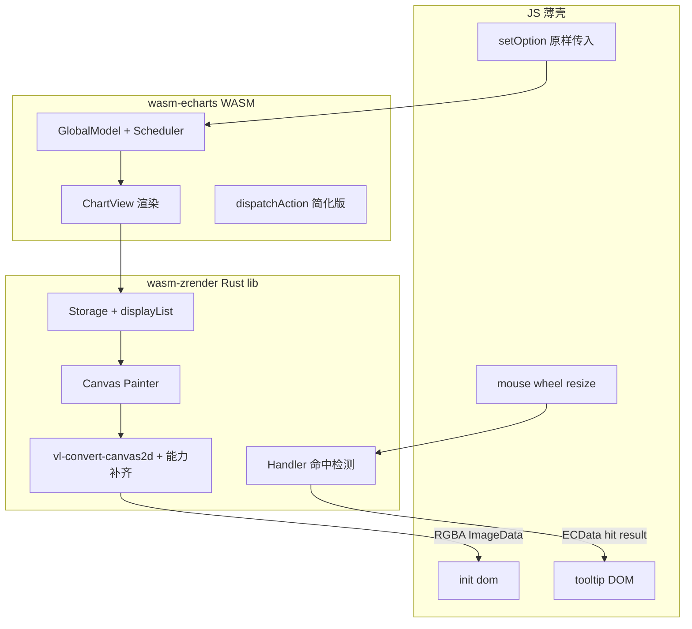

# wasm-echarts 移植实施规划

## 目标与约束

依据 [README.md](e:\wasm-echarts\README.md)：

- **核心目标**：快速将 ECharts `option` 绘制到 canvas，**不注重动画**（动画 API 直接跳到终态）
- **渲染模式**：仅 canvas，忽略 SVG / DOM 组件（Loading、DataView 等）
- **架构顺序**：先 [wasm-zrender](e:\wasm-echarts\wasm-echarts-rs\crates\wasm-zrender)，后 [wasm-echarts](e:\wasm-echarts\wasm-echarts-rs\crates\wasm-echarts)
- **参考源码**（只读，禁止修改）：[zrender-master](e:\wasm-echarts\zrender-master)、[echarts-master](e:\wasm-echarts\echarts-master)

## 当前状态

| 模块 | 状态 |
|------|------|
| `wasm-echarts` | wasm-pack 模板，仅 `greet()` |
| `wasm-zrender` | 空占位，`fn main()` 残留 |
| crate 依赖关系 | **未连接** |
| vl-convert-canvas2d | **未引入** |
| JS 集成 / demo | **无** |

---

## 总体架构



**数据流**（对齐 zrender 现有设计）：

```
Element 树 → Storage.updateDisplayList → Painter.brush → vl-convert ctx → RGBA buffer → JS putImageData/blit
```

**JS / WASM 职责划分**：

| 层 | WASM (Rust) | JS 薄壳 |
|----|-------------|---------|
| option 解析 | 递归解析 `JsValue` → `OptionValue`；函数保留为 `js_sys::Function` | 原样传入用户 option 对象 |
| 函数回调 | visual/render 阶段 `call0/call1/call2` 调用，解析返回值 | — |
| 布局/坐标/绘制 | 坐标系、SeriesData、ChartView、Painter | — |
| 命中检测 | 几何 contain（自实现 winding number） | 转发 pointer 坐标 |
| tooltip / 高亮 | 构造 `CallbackDataParams` 调 formatter；改 element state 并重绘 | DOM 渲染 HTML、定位 |
| resize | 重算 layout + 全量 refresh | ResizeObserver → 调 WASM |
| 动画 | 直接终态（跳过中间帧） | — |

---

## 阶段 0：工程基础（1 周）

**目标**：可编译、可调试、可 demo 的最小工程闭环。

1. **修正 crate 结构**
   - [wasm-zrender/src/lib.rs](e:\wasm-echarts\wasm-echarts-rs\crates\wasm-zrender\src\lib.rs)：改为正规 `lib` 入口，导出模块骨架
   - [wasm-echarts/Cargo.toml](e:\wasm-echarts\wasm-echarts-rs\crates\wasm-echarts\Cargo.toml)：添加 `wasm-zrender = { path = "../wasm-zrender" }`
   - 初始化时调用 `utils::set_panic_hook()`

2. **引入 Painter 后端**
   - `wasm-zrender` 添加 `vl-convert-canvas2d`（当前最新 `2.0.0-rc1`，纯 Rust，基于 tiny-skia + cosmic-text）
   - 封装 `CanvasBackend` trait，隔离 vl-convert API 与 zrender Painter

3. **JS 构建与 demo**
   - 新增 `examples/` 或 `demo/` 目录：`wasm-pack build --target web`
   - 最小 HTML：加载 WASM → 创建 canvas → 调用 Rust 绘制一个 Rect/Circle → blit 到页面

4. **模块目录规划**（`wasm-zrender/src/`）

```
core/          # matrix, bbox, util, types
element/       # Element, Transformable, Displayable, Group
graphic/       # Path, shapes (Rect, Circle, Line, Polygon...)
storage/       # Storage, displayList, timsort
canvas/        # Painter, Layer, brush, backend
contain/       # path/line/arc hit testing
handler/       # Handler (简化版，无 DOM proxy)
```

---

## 阶段 1：wasm-zrender P0 — 最小可渲染闭环（3–4 周）

**目标**：Rust 侧复现 zrender `Storage → Painter → brush` 管线，能绘制基础图形。

**参考源码**（只读对照）：
- [zrender-master/src/Storage.ts](e:\wasm-echarts\zrender-master\src\Storage.ts)
- [zrender-master/src/canvas/Painter.ts](e:\wasm-echarts\zrender-master\src\canvas\Painter.ts)
- [zrender-master/src/canvas/graphic.ts](e:\wasm-echarts\zrender-master\src\canvas\graphic.ts)
- [zrender-master/src/core/PathProxy.ts](e:\wasm-echarts\zrender-master\src\core\PathProxy.ts)

**实现要点**：

| 优先级 | 模块 | 关键能力 |
|--------|------|----------|
| P0 | `Element` / `Transformable` | 变换矩阵、dirty bit、`markRedraw` |
| P0 | `Group` / `Displayable` | z/z2/zlevel、culling |
| P0 | `Path` + `PathProxy` | buildPath → rebuildPath 双通道 |
| P0 | `Storage` | DFS 构建 displayList + z 排序 |
| P0 | `Painter` + `Layer` | 单层 canvas 先跑通，后续扩展 zlevel |
| P0 | 基础 shape | Rect, Circle, Line, Polygon, Polyline |
| P0 | `brush` | fill/stroke/clip/transform/globalAlpha |

**动画策略**：`Animation` 模块不移植；`markRedraw` 后直接 refresh，属性变更无插值。

**验收标准**：
- Rust 单元测试：构建 Group + 若干 Path → Painter.refresh → 输出固定尺寸 PNG/RGBA
- 与 zrender `test/benchmark.html` 同类简单场景视觉对比（手工）

---

## 阶段 2：vl-convert 能力补齐（2 周）

README 已明确 vl-convert-canvas2d **不支持或残缺**的能力，需在 `canvas/backend/` 扩展：

| 缺口 | 方案 |
|------|------|
| `shadowBlur/Color/Offset` | tiny-skia 层手动实现 shadow pass，或 Painter 前预处理 |
| CSS filter | MVP 忽略；echarts 常用 shadow 优先补齐 |
| `isPointInPath` | **自实现**：复用 PathProxy 数据 + winding number（参考 [zrender-master/src/contain/path.ts](e:\wasm-echarts\zrender-master\src\contain\path.ts)） |
| 径向渐变 r0 | 扩展 RadialGradient 参数映射；vl-convert 不完整处用 tiny-skia 直绘 |
| conic gradient | MVP 降级为线性/径向近似，或 Phase 3 再补 |

**同步移植 P2 样式模块**：
- LinearGradient / RadialGradient / Pattern
- lineDash、lineCap/Join
- Image + drawImage（字体/图片资源需 JS 传入 bytes 或 URL 预加载）

---

## 阶段 3：wasm-zrender P1 — 交互基础（2 周）

**目标**：WASM 内完成 hit test，为 tooltip/高亮提供数据。

**参考**：[zrender-master/src/Handler.ts](e:\wasm-echarts\zrender-master\src\Handler.ts)

1. **Handler.findHover(x, y)**
   - 反向遍历 displayList
   - Path winding number + stroke 距离检测
   - clipPath 链过滤

2. **Element 元数据**
   - 每个 Displayable 携带 `ECData` 等价结构：`series_index`, `data_index`, `data_type`
   - 供 echarts 层反查

3. **状态样式（简化）**
   - `emphasis` / `select` state：直接切换样式并重绘（无 morph 动画）
   - 参考 [zrender-master/src/Element.ts](e:\wasm-echarts\zrender-master\src\Element.ts) 的 `useState`

4. **WASM 导出 API（zrender 级）**

```rust
// 示意，非最终 API
pub struct ZRenderInstance { /* storage, painter, handler */ }
impl ZRenderInstance {
    pub fn new(width: u32, height: u32, dpr: f64) -> Self;
    pub fn add_element(/* ... */) -> ElementId;
    pub fn refresh(&mut self) -> Vec<u8>;  // RGBA
    pub fn find_hover(&self, x: f64, y: f64) -> Option<HitResult>;
    pub fn resize(&mut self, w: u32, h: u32, dpr: f64);
}
```

---

## 阶段 4：JS 薄壳 + wasm-echarts API 骨架（2 周）

**目标**：对外暴露类 ECharts API，JS 负责 DOM 与事件桥接。

### JS 层（新建 `packages/wasm-echarts-js/` 或 `demo/js/`）

```javascript
// 对外 API 对齐 echarts canvas 模式
echarts.init(dom, { renderer: 'canvas' })
instance.setOption(option)
instance.resize()
instance.on('click', handler)
instance.dispatchAction({ type: 'highlight', ... })
instance.dispose()
```

### option 处理策略：保留 JsFunction + callN

用户 `setOption(option)` 时，WASM 直接接收 `JsValue`，递归解析时遇到 function 则保留为 `js_sys::Function`，在 visual/render/tooltip 阶段按需 `callN` 调用，与官方 ECharts option 格式一致。

#### 核心数据结构

```rust
// wasm-echarts/src/option/mod.rs（示意）
pub enum OptionValue {
    Null,
    Bool(bool),
    Number(f64),
    String(String),
    Array(Vec<OptionValue>),
    Object(IndexMap<String, OptionValue>),
    Function(js_sys::Function),  // 不可 serde，单独分支
}

// 从 JsValue 递归解析（不能用 serde-wasm-bindgen 整包反序列化）
pub fn parse_option_value(v: &JsValue) -> Result<OptionValue, JsValue>;
```

#### 回调调用封装

```rust
// wasm-echarts/src/bridge/callback.rs（示意）
pub struct JsCallback(js_sys::Function);

impl JsCallback {
    pub fn call_formatter(&self, params: &JsValue) -> Result<String, JsValue> {
        let ret = self.0.call1(&JsValue::NULL, params)?;
        ret.as_string().ok_or_else(/* ... */)
    }

    pub fn call_color(&self, params: &JsValue) -> Result<JsValue, JsValue> {
        self.0.call1(&JsValue::NULL, params)
    }

    // renderItem: call2(params, api)
    pub fn call_render_item(&self, params: &JsValue, api: &JsValue) -> Result<JsValue, JsValue> {
        self.0.call2(&JsValue::NULL, params, api)
    }
}
```

#### params 构造（对齐 echarts CallbackDataParams）

参考 [echarts-master/src/util/types.ts](e:\wasm-echarts\echarts-master\src\util\types.ts) 的 `CallbackDataParams`，在 Rust 侧用 `js_sys::Object` 按需构造：

```rust
pub fn build_data_params(
    series_index: u32,
    data_index: u32,
    name: &str,
    value: &JsValue,
    // seriesName, color, percent, dimensionNames, encode, ...
) -> JsValue { /* Object.assign */ }
```

调用时机与官方一致（参考 [echarts-master/src/visual/style.ts](e:\wasm-echarts\echarts-master\src\visual\style.ts)、[dataFormat.ts](e:\wasm-echarts\echarts-master\src\model\mixin\dataFormat.ts)）：

| 字段 | 调用时机 | 签名 |
|------|----------|------|
| `label.formatter` | visual / label layout | `(params) => string` |
| `itemStyle.color` | visual 阶段 | `(params) => color` |
| `symbol` / `symbolSize` | visual 阶段 | `(params) => ...` |
| `tooltip.formatter` | hover 时 | `(params) => string \| HTMLElement` |
| `axisLabel.formatter` | 轴渲染 | `(value, index) => string` |
| `series.renderItem` | CustomView.render | `(params, api) => graphicSpec` |

#### setOption 合并语义

- function 字段在 merge 时**不能被 JSON 深拷贝**，需按 ECharts `OptionManager` 规则：新 option 的 function 覆盖旧值，未出现的字段保留
- Rust `OptionModel` 中 function 存 `JsFunction` 引用（由 JS GC 管理生命周期）；`dispose()` 时清空引用

#### 返回值解析

函数返回值类型多样，需分字段解析：

- `formatter` → `string`（或 rich text 对象，Phase 6+）
- `color` → `string` / gradient 对象 → 转 Rust `Color` 或保留 `JsValue` 延迟解析
- `renderItem` → declarative graphic spec（`{ type, shape, style }`）→ 转 zrender Element

#### 性能与边界

| 点 | 说明 |
|----|------|
| WASM↔JS 边界开销 | 大数据量时每个 dataIndex 调一次 formatter/color 会有开销；可后续对**纯常量结果**做 per-series 缓存 |
| `this` 绑定 | ECharts 回调通常无 `this`，用 `callN(&JsValue::NULL, ...)` 即可 |
| 异常 | JS 回调 throw 时捕获并 `console.error`，该 dataIndex 降级为默认样式 |
| HTMLElement 返回值 | `tooltip.formatter` 返回 DOM 节点时，由 JS 薄壳处理（WASM 只处理 string 路径，DOM 路径走 JS） |
| 单元测试 | 纯 Rust 测试用 mock `OptionValue` 常量；集成测试在浏览器注入真实 function |

### 事件桥接

```
canvas.addEventListener('mousemove', e => {
  const hit = wasm.find_hover(e.offsetX, e.offsetY);
  // WASM 内部调 tooltip.formatter(params)，返回 string；JS 只负责 DOM 渲染
  if (hit) js.showTooltip(wasm.get_tooltip_content(hit));
});
ResizeObserver → wasm.resize(w, h, dpr);
```

### WASM 导出（wasm-echarts）

```rust
#[wasm_bindgen]
pub struct EChartsInstance { /* zrender + model */ }

#[wasm_bindgen]
impl EChartsInstance {
    pub fn init(width: u32, height: u32, dpr: f64) -> Self;
    pub fn set_option(&mut self, option: JsValue) -> Result<(), JsValue>; // 自定义 parse_option_value，保留 Function
    pub fn resize(&mut self, w: u32, h: u32, dpr: f64);
    pub fn refresh(&mut self) -> Vec<u8>;
    pub fn find_hover(&self, x: f64, y: f64) -> JsValue;
    pub fn dispatch_action(&mut self, action: JsValue);
}
```

---

## 阶段 5：echarts 核心移植 — MVP 图表（4–6 周）

**目标**：`setOption` 驱动折线图 + 柱状图完整渲染（默认 MVP 范围）。

**参考 echarts 管线**（[echarts-master/src/core/echarts.ts](e:\wasm-echarts\echarts-master\src\core\echarts.ts)）：

```
setOption → OptionManager.merge → GlobalModel
  → restoreData → dataProcessor → visualTasks
  → coordSys.create/update → ChartView.render → zrender group
  → flush
```

**分模块移植优先级**：

| 优先级 | echarts 模块 | 说明 |
|--------|-------------|------|
| P0 | `model/Global.ts`, `OptionManager` | option 合并、media query |
| P0 | `data/SeriesData`, `Source` | 数据存储与 layout/visual 管道 |
| P0 | `coord/cartesian` | 直角坐标系（line/bar 必需） |
| P0 | `component/grid`, `axis` | 网格与坐标轴 |
| P0 | `chart/line/LineView` | 折线/面积 |
| P0 | `chart/bar/BarView` | 柱状图 |
| P1 | `component/legend`, `tooltip` 数据层 | legend 绘制；tooltip 仅数据，DOM 在 JS |
| P2 | `component/dataZoom` | 缩放（事件 + 重算 extent） |
| P3 | polar/pie/scatter 等 | 后续扩展 |

**ChartView 模式**（参考 [echarts-master/src/chart/line/LineView.ts](e:\wasm-echarts\echarts-master\src\chart\line\LineView.ts)）：
- 从 `SeriesData.getLayout('points')` 取坐标
- 创建 Polyline/Polygon/Rect 等 zrender 图元
- `setCommonECData` 写入 element 元数据

**Scheduler 简化**：
- 不做渐进式 `renderSeries('remain')`；大数据量场景 Phase 7 优化
- `lazyUpdate` 合并为单次 update

**动画跳过**：
- 所有 `hasAnimation` 判断改为 `false`
- 属性直接设终态值（可参考 echarts `ssr` 分支逻辑）

---

## 阶段 6：交互完善（2–3 周）

| 功能 | WASM | JS |
|------|------|-----|
| hover 高亮 | `dispatchAction highlight/downplay` → 改 element state + refresh | — |
| click 选中 | hit test + select state | `chart.on('click')` 回调 |
| tooltip | WASM 内调 `tooltip.formatter(params)` 得 string；返回定位信息 | DOM 渲染 HTML、处理 HTMLElement 返回值 |
| dataZoom | 重算 scale/extent + 全量 refresh | 转发 wheel/pinch 事件 |
| axisPointer | 计算 axis value + 标线位置 | 可选 DOM 辅助线 |

---

## 阶段 7：扩展与优化（持续）

- 更多图表：pie、scatter、gauge…
- 文本：RichText / TSpan（参考 zrender `graphic/Text.ts`，依赖 cosmic-text）
- 性能：脏矩形（`useDirtyRect`）、多 Layer zlevel、离屏 worker
- 测试体系：
  - Rust：`cargo test` 几何/布局单元测试
  - 视觉：选取 echarts `test/*.html` 用例，option JSON 对比 WASM 输出
  - 基准：对比 JS echarts vs WASM 的 `setOption + refresh` 耗时

---

## 关键设计决策（默认）

因未指定偏好，规划采用以下默认：

1. **MVP 图表**：折线图 + 柱状图
2. **函数型 option**：保留 `js_sys::Function`，visual/render 阶段 `callN` 调用；自定义 `OptionValue` 解析器（不用 serde 整包反序列化）
3. **输出方式**：WASM 产出 RGBA buffer → JS `putImageData` 或 `ImageBitmap` blit（避免 WASM 直接操作 DOM canvas ctx，保持离屏渲染目标）
4. **文本**：Phase 5 先用 vl-convert + cosmic-text；复杂 RichText Phase 7
5. **源码对照**：zrender/echarts TS 作行为参考，Rust 侧按 idiomatic 方式重写，不做 1:1 文件映射
6. **renderItem**：同样走 `call2(params, api)`；`api` 对象在 Rust 侧实现为 `js_sys::Object` 暴露 `value/style/coord/...` 方法

---

## 风险与缓解

| 风险 | 缓解 |
|------|------|
| vl-convert 与浏览器 canvas 行为差异 | 建立 golden PNG 对比测试；差异文档化 |
| echarts 体量巨大 | 严格 MVP 范围；模块化 feature flag（`line`, `bar`） |
| 函数回调 WASM 边界开销 | 对常量结果做 per-series 缓存；热点路径（如 color）可 batch 调用 |
| renderItem `api` 对象复杂 | 分阶段实现 api 子集，与 CustomSeries 官方文档对齐 |
| WASM 体积 | `opt-level = "s"` + wasm-opt；按需编译 chart feature |
| 字体渲染 | **已实现**：宿主 `registerFont` / Rust `register_font` 注入 fontdb；详见 [wasm-zrender 字体规范](wasm-zrender_api_对齐_98a6aa98.plan.md#字体加载规范必遵) |

---

## 建议的首个里程碑（Milestone 1）

> **4–6 周内交付**：demo 页面调用 `echarts.init` → `setOption` 一个简单 `{ xAxis, yAxis, series: [{ type: 'line', data: [...] }] }` → canvas 正确显示折线 + 坐标轴，鼠标 hover 返回 dataIndex。

此里程碑前需完成：阶段 0 + 1 + 2（部分）+ 4（骨架）+ 5（line 最小路径）。
