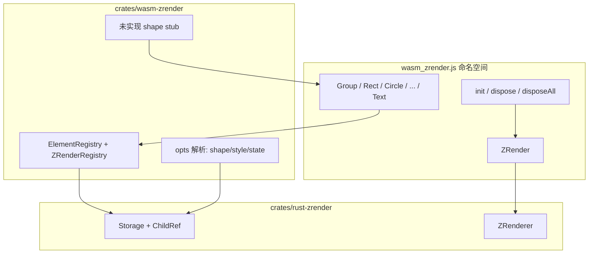

# wasm-zrender 对齐官方 zrender 导出 API

## 目标用法（对齐官方，保留离屏渲染差异）

```javascript
import initWasm, { init, dispose, registerFont, Group, Rect, Circle, Line, Polygon, Sector, Text } from '@wasm-zrender/wasm_zrender.js';

await initWasm();

// 文本渲染前须注册字体（WASM 无系统字体，见下文「字体加载规范」）
const fontBytes = new Uint8Array(await (await fetch('/fonts/NotoSansSC-Regular.ttf')).arrayBuffer());
registerFont(fontBytes, { familyName: 'Noto Sans SC', sansSerif: ['Noto Sans SC'] });

const zr = init(null, { width: 480, height: 360, devicePixelRatio: dpr });

const g = new Group();
g.add(new Rect({
  shape: { x: 20, y: 20, width: 100, height: 60 },
  style: { fill: '#5470c6' },
}));
g.add(new Circle({
  shape: { cx: 180, cy: 80, r: 40 },
  style: { fill: 'rgba(145, 204, 117, 0.8)', stroke: '#ee6666', lineWidth: 3 },
}));
zr.add(g);

const rgba = zr.refresh(); // 同步返回 RGBA（与官方异步 flush 到 DOM 不同，文档说明）
ctx.putImageData(new ImageData(new Uint8ClampedArray(rgba), w, h), 0, 0);

const hover = zr.findHover(x, y); // 返回 { target, topTarget } 形态的 Element 引用
dispose(zr);
```

**刻意保留的差异**（README/文档写清）：
- 仅 canvas 离屏模式，无 SVG painter / animation 帧循环
- `refresh()` 同步返回像素，需 JS `putImageData` 上屏
- `init(dom)` 的 `dom` 参数忽略（尺寸来自 opts）
- **文本渲染前须由宿主注册字体**（WASM 不读系统字体，见「字体加载规范」）
- 未实现能力：动画、`on('click')` 事件总线、coarse pointer 等

---

## 字体加载规范（必遵）

wasm-zrender 在 **Rust 离屏 Canvas**（vl-convert-canvas2d + cosmic-text）中绘制文本，**不经过浏览器 `ctx.font`**。WASM / Wasmer 等宿主环境读不到操作系统字体，因此：

1. **禁止**在 `.wasm` 内嵌入默认字体（体积大、不可定制）。
2. **必须**由宿主在运行时将字体文件 bytes（TTF / OTF / WOFF）注册到全局 `fontdb`。
3. 注册时机：`initWasm()` 之后、`init()` 创建实例之前（或任意时刻；已存在的 `ZRender` 会热更新 fontdb）。

### JS API（wasm-zrender）

| 导出 | 说明 |
|------|------|
| `registerFont(data, opts?)` | `data`: `Uint8Array`；`opts.familyName` 覆盖族名；`opts.sansSerif` 映射 CSS `sans-serif` |
| `clearFonts()` | 清空已注册字体（测试用） |

```javascript
await initWasm();

const bytes = new Uint8Array(await (await fetch('/fonts/NotoSansSC-Regular.ttf')).arrayBuffer());
registerFont(bytes, {
  familyName: 'Noto Sans SC',
  sansSerif: ['Noto Sans SC'],
});

const zr = init(null, { width: 480, height: 360 });
zr.add(new Text({ style: { text: '中文', x: 24, y: 48, fontSize: 18, fill: '#333' } }));
```

site 薄壳辅助：`site/src/zrender/fonts.js` 提供 `loadFontFromUrl` / `ensureDefaultFont`；默认字体文件位于 `site/public/fonts/NotoSansSC-Regular.ttf`。

### Rust API（rust-zrender，Wasmer / 原生测试）

```rust
use rust_zrender::{register_font, RegisterFontOptions, ZRenderer};

register_font(font_bytes, RegisterFontOptions {
    family_name: Some("Noto Sans SC".into()),
    sans_serif: Some(vec!["Noto Sans SC".into()]),
})?;

let zr = ZRenderer::new(480, 360)?;
```

- **wasm32**：`load_system_fonts = false`，仅使用已注册字体。
- **原生**：默认仍加载系统字体，已注册字体与之合并。

### 示例与文档同步要求

- **text** 示例必须在源码与 `examples-catalog.js` 展示 `fetch` + `registerFont` 流程。
- README、`site/zrender/docs/index.html` 须包含本节要点。
- 未注册字体时渲染 `Text` 会 panic（`no default font found`），文档中须明确说明。

---

## 架构



---

## 一、删除 scene 模块并清理旧 API

**删除/移除**：
- [`crates/wasm-zrender/src/scene.rs`](wasm-echarts-rs/crates/wasm-zrender/src/scene.rs) 整文件
- [`instance.rs`](wasm-echarts-rs/crates/wasm-zrender/src/instance.rs) 中的 `load_scene`、`scene: String` 字段、resize 时重载 scene 逻辑
- 旧 API：`ZRenderInstance`、`load_scene`、`highlight_path`、`downplay_path`、`find_hover`（snake_case）

**迁移 Demo 内容**：将 `scene.rs` 里 5 个 `build_*_scene` 的逻辑改写为 **site 示例源码中的官方风格 JS**（见第四节），不再由 Rust 预设。

---

## 二、wasm-zrender 模块重组

建议目录（替代现有 `instance.rs + scene.rs`）：

| 文件 | 职责 |
|------|------|
| [`lib.rs`](wasm-echarts-rs/crates/wasm-zrender/src/lib.rs) | 导出 init/dispose/全部 graphic 类型 |
| `zrender.rs` | `ZRender` wasm 类 + 实例表 `instances: HashMap<u32, ZRenderer>` |
| `registry.rs` | `ElementHandle { zr_id, kind: Group/Path/Text, index }`，父子关系校验 |
| `bridge/opts.rs` | 从 `JsValue` 解析 `{ shape, style, z, zlevel, silent, ... }` → rust 结构 |
| `bridge/hit.rs` | `HitResult` → `{ target, topTarget }` Element 包装 |
| `element/mod.rs` | 基类 `Element`（wasm 引用类型，含 handle + parent 链接） |
| `graphic/group.rs` | `Group`：`add` / `remove` / `removeAll` |
| `graphic/path.rs` | `Path` 基类：`useState` / `setStateStyle` |
| `graphic/shapes/*.rs` | 各 shape 子类 constructor |
| `graphic/text.rs` | `Text` |
| `graphic/stub.rs` | 未实现 shape 的统一 stub 宏/基类 |
| `export/gradient.rs` | `LinearGradient` / `RadialGradient` / `Pattern` 类（可先作 style 解析辅助对象） |

---

## 三、对外 API 对齐 export.ts（完整导出 + stub）

参照 [`zrender-master/src/export.ts`](zrender-master/src/export.ts) 与 [`zrender-master/src/zrender.ts`](zrender-master/src/zrender.ts)，在 **wasm-bindgen 层直接具名导出**：

### 3.1 顶层函数（zrender.ts）

| 导出 | 行为 |
|------|------|
| `init(dom?, opts?)` | 创建 `ZRender`，注册到 instances |
| `registerFont(data, opts?)` | 注册字体 bytes 到全局 fontdb（Text 渲染前必调） |
| `clearFonts()` | 清空已注册字体 |
| `dispose(zr)` | 释放实例 |
| `disposeAll()` | 清空全部 |
| `getInstance(id)` | 按 id 取实例（可选） |

### 3.2 ZRender 实例方法

| 方法 | 对齐官方 | 实现要点 |
|------|----------|----------|
| `add(el)` | yes | `storage.add_root`，元素需已挂载 handle |
| `remove(el)` | yes | 需先在 rust-zrender 补 `Storage::del_root` |
| `refresh()` | 部分 | 调 `ZRenderer::refresh()` 返回 `Vec<u8>` |
| `flush()` | alias | 同 `refresh()`（文档说明无 animation 队列） |
| `resize(opts)` | yes | 调 `resize_with_dpr`，**不**重载预设 scene |
| `findHover(x, y)` | yes | camelCase；返回 `{ target, topTarget }` |
| `setBackgroundColor(c)` | stub/后续 | 若 rust-zrender 未支持则文档标注 |

### 3.3 graphic 类型（export.ts 全量）

**已实现（接 rust-zrender）**：

- `Group`, `Rect`, `Circle`, `Line`, `Polygon`, `Polyline`, `Sector`, `Text`

**stub 导出（类存在，构造或 add 时 `throw new Error('... not implemented')`）**：

- `Path`, `Image`, `CompoundPath`, `TSpan`, `IncrementalDisplayable`, `Displayable`
- `Arc`, `BezierCurve`, `Droplet`, `Ellipse`, `Heart`, `Isogon`, `Ring`, `Rose`, `Star`, `Trochoid`
- `LinearGradient`, `RadialGradient`, `Pattern`
- `Point`, `BoundingRect`, `OrientedBoundingRect`
- 工具模块 `matrix`, `vector`, `color`, `path`, `util`, `morph`, `parseSVG`, `showDebugDirtyRect`, `setPlatformAPI` → 导出空对象或最小 stub 函数

每个 stub 类需带 `type` 字段（如 `'rect'`, `'arc'`）与官方一致，便于测试与后续补实现。

### 3.4 Element 行为对齐

- `Group.add(child)` / `remove(child)` → 更新 `ChildRef` 树
- `Path.useState('emphasis')` → 调 `rust_zrender::Path::use_state`（替代旧 `highlight_path`）
- `Path.setStateStyle('emphasis', { fill, lineWidth })` → 调 `ZRenderer::set_path_state_style`
- 构造函数支持官方 opts 形态：`{ shape, style, z, zlevel, silent, name }`
- `findHover` 返回的 `target` 为 wasm `Element` 引用，可读取 `type` / 关联 ECData（通过 getter）

### 3.5 rust-zrender 必要补全（wasm-zrender 依赖）

在 [`crates/rust-zrender/src/storage/mod.rs`](wasm-echarts-rs/crates/rust-zrender/src/storage/mod.rs) 增加：

- `del_root(child: ChildRef)` / `group_remove_child(group, child)` — 支撑 `zr.remove` / `group.remove`
- （可选本阶段）`ChildRef::Text` — 若暂不做，`Text` 仅支持 `zr.add(text)` 根节点，文档标注与官方 `group.add(text)` 的差异

---

## 四、site 示例与文档改造

| 文件 | 变更 |
|------|------|
| [`site/src/zrender/examples-catalog.js`](wasm-echarts-rs/site/src/zrender/examples-catalog.js) | 示例源码改为 `init` + `new Rect/Circle/...` + `zr.add`，删除 `load_scene` |
| [`site/src/zrender/zrender.js`](wasm-echarts-rs/site/src/zrender/zrender.js) | 瘦身为 **仅 canvas 上屏辅助**（`putImageData`、事件坐标转换），或合并进示例；不再维护 `createViewer({ scene })` |
| [`site/src/zrender/example-runner.js`](wasm-echarts-rs/site/src/zrender/example-runner.js) | 执行真实 JS 源码（类似 echarts 示例），去掉 JSON `scene` 配置 |
| [`site/src/shared/parse-source.js`](wasm-echarts-rs/site/src/shared/parse-source.js) | 删除/替换 `parseZrenderSource` 的 scene JSON 解析 |
| [`site/zrender/docs/index.html`](wasm-echarts-rs/site/zrender/docs/index.html) | API 表改为 export.ts 风格；**字体加载**专节；注明 stub 列表与离屏差异 |
| [`README.md`](README.md) | wasm-zrender API 小节更新 |

5 个示例与旧 scene 的映射（内容迁到 JS，不再 Rust 预设）：

- **shapes** → Group + Rect/Circle/Line/Polygon
- **text** → `new Text({ style: { text, x, y, ... } })`
- **sector** → 循环 `new Sector({ shape: { cx, cy, r, startAngle, endAngle } })`
- **hit** → shapes + `mousemove` + `findHover`
- **state** → Rect + `setStateStyle` + `useState('emphasis')`

---

## 五、pkg 导出形态（wasm 直接命名空间）

`wasm-pack build` 后 [`pkg/wasm_zrender.d.ts`](wasm-echarts-rs/crates/wasm-zrender/pkg/wasm_zrender.d.ts) 应包含：

```typescript
export function init(dom: any, opts?: ZRenderInitOpt): ZRender;
export function dispose(zr: ZRender): void;
export class ZRender { add(el: Element): void; refresh(): Uint8Array; findHover(x: number, y: number): HoverResult; ... }
export class Group extends Element { add(el: Element): void; }
export class Rect extends Path { ... }
// ... 全部 export.ts 类型（stub 标注 @throws）
```

可选：在 pkg 增加 `export default { init, dispose, Group, Rect, ... }` 以支持 `import * as zrender` 习惯（通过 `#[wasm_bindgen]` 的 inline_js 或手写 `pkg/zrender.js` 重导出层，不引入 site 薄壳）。

---

## 六、测试与验收

**Rust 单元测试**（`wasm-zrender` dev-dependencies + `wasm-bindgen-test`）：
- `init` → `Group.add(Rect)` → `refresh` 非空 RGBA
- `findHover` 返回正确 Element handle
- stub 类 `new Arc(...)` 抛预期错误

**手工验收**：
```bash
cd wasm-echarts-rs/crates/wasm-zrender && wasm-pack build --target web
cd ../../site && npm run dev
```
- 5 个 zrender 示例页均可预览
- 文档 API 与 pkg `.d.ts` 一致
- 全文无 `load_scene` / `scene.rs` 引用

---

## 实施顺序建议

1. rust-zrender：`del_root` / group remove
2. wasm-zrender 基础设施：`ZRender` + registry + opts 解析
3. 已实现图元：Group + 7 种 shape + Text + Path 状态 API
4. export.ts 全量 stub 导出 + `.d.ts` 注释
5. 删除 scene.rs，迁移 site 示例与文档
6. 测试与 README 更新
