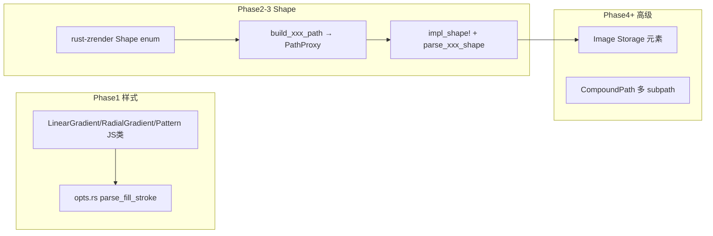

# wasm-zrender API 批量补录计划

## 现状与目标

**已实现（8 类）：** `Group`、`Rect`、`Circle`、`Line`、`Polygon`、`Polyline`、`Sector`、`Text`

**Stub 清单（[`graphic/stub.rs`](wasm-echarts-rs/crates/wasm-zrender/src/graphic/stub.rs) + [`export.rs`](wasm-echarts-rs/crates/wasm-zrender/src/export.rs)）：**

| 类别 | 成员 |
|------|------|
| Path shape | Arc, BezierCurve, Ellipse, Ring, Heart, Star, Rose, Droplet, Isogon, Trochoid |
| 图元 | Image, CompoundPath, Path(通用), TSpan, Displayable, IncrementalDisplayable |
| 样式对象 | LinearGradient, RadialGradient, Pattern |
| 几何 | Point, BoundingRect, OrientedBoundingRect |
| 工具模块 | matrix, vector, color, path, util, morph, parseSVG |

**关键发现：** rust-zrender 渲染层已支持 `LinearGradient` / `RadialGradient` / `Pattern`（[`style.rs`](wasm-echarts-rs/crates/rust-zrender/src/graphic/style.rs) + [`canvas/helper.rs`](wasm-echarts-rs/crates/rust-zrender/src/canvas/helper.rs)），但 wasm 桥 [`opts.rs`](wasm-echarts-rs/crates/wasm-zrender/src/bridge/opts.rs) 的 `parse_fill_stroke` 将非字符串 fill/stroke 一律丢弃为 `None`。多数 shape stub 只需补 rust shape + wasm 四步模板，**不是从零写渲染器**。



---

## 标准扩展模板（Phase 2–3 复用）

每个 Path 类 shape 固定改动 5 处（参考现有 [`Sector`](wasm-echarts-rs/crates/rust-zrender/src/graphic/shapes/sector.rs) + [`impl_shape!`](wasm-echarts-rs/crates/wasm-zrender/src/graphic/shapes.rs)）：

1. **rust-zrender** `shapes/xxx.rs`：`XxxShape` struct + `build_xxx_path(ctx, shape)` 写入 [`PathProxy`](wasm-echarts-rs/crates/rust-zrender/src/graphic/path_proxy.rs)
2. **rust-zrender** [`shapes/mod.rs`](wasm-echarts-rs/crates/rust-zrender/src/graphic/shapes/mod.rs)：扩展 `Shape` enum + `build_path` dispatch
3. **rust-zrender** [`path.rs`](wasm-echarts-rs/crates/rust-zrender/src/graphic/path.rs)：`estimate_bbox` 新增分支（culling/脏区依赖）
4. **wasm-zrender** [`bridge/shape.rs`](wasm-echarts-rs/crates/wasm-zrender/src/bridge/shape.rs)：`parse_xxx_shape` 解析 `opts.shape` 字段
5. **wasm-zrender** [`bridge/build.rs`](wasm-echarts-rs/crates/wasm-zrender/src/bridge/build.rs) + [`graphic/shapes.rs`](wasm-echarts-rs/crates/wasm-zrender/src/graphic/shapes.rs)：`parse_shape` 分支 + `impl_shape!(Xxx, "xxx")`，从 stub.rs 移除对应 macro

**buildPath 参考源：** [`zrender-master/src/graphic/shape/*.ts`](zrender-master/src/graphic/shape/)（逐文件 port 到 Rust PathProxy 调用）

**命中检测：** PathProxy 命令正确写入后，[`contain/path.rs`](wasm-echarts-rs/crates/rust-zrender/src/contain/path.rs) 自动通过 kurbo 回放；Arc 建议用 `PathProxy.arc()` 而非 Sector 的折线近似。

---

## Phase 1：样式与渐变（最高 ROI，~2–3 天）

> rust 渲染已就绪，主要补 wasm 桥 + JS 类

### 1.1 扩展 `parse_fill_stroke`（[`opts.rs`](wasm-echarts-rs/crates/wasm-zrender/src/bridge/opts.rs)）

识别以下 JS 形态并映射到 `FillStrokeStyle`：

- **字符串色值**（已有）
- **对象 inline gradient：** `{ type: 'linear', x, y, x2, y2, colorStops, global }` / `{ type: 'radial', x, y, r, r0?, colorStops, global }`
- **Gradient 类实例：** 检测 `LinearGradient` / `RadialGradient` wasm 对象（通过 `type` 字段或 `instanceof` 等价逻辑：读 `x/y/x2/y2/r/colorStops/global`）
- **Pattern 对象：** `{ image, repeat, x, y, scaleX, scaleY, rotation }` 或 `Pattern` 类实例

同步扩展 `parse_path_style_patch` 的 fill/stroke 分支；补 `lineCap` / `lineJoin` 解析（`PathStyle` 已有字段）。

### 1.2 实现 Gradient / Pattern JS 类

新建 [`graphic/gradient.rs`](wasm-echarts-rs/crates/wasm-zrender/src/graphic/gradient.rs)（或 `style.rs`），替换 stub.rs 中三个类：

| 类 | 构造函数对齐官方 | 存储 |
|----|------------------|------|
| `LinearGradient` | `new(x, y, x2, y2, colorStops?, global?)` | 内部字段 + `type: 'linear'` |
| `RadialGradient` | `new(x, y, r, colorStops?, global?)` | 含 `r0` |
| `Pattern` | `new(image, repeat?)` | 需 JS 侧将 `HTMLImageElement` / `Canvas` / URL 转为 RGBA bytes（web-sys `CanvasRenderingContext2D.getImageData` 或 fetch+decode） |

Pattern 图像解码可复用 [`canvas/image.rs`](wasm-echarts-rs/crates/rust-zrender/src/canvas/image.rs) 的 `draw_image_rgba` 路径；在 wasm 层缓存 `Arc<[u8]>` + width/height。

### 1.3 rust-zrender 小修

- [`canvas/helper.rs`](wasm-echarts-rs/crates/rust-zrender/src/canvas/helper.rs)：接线 `PatternStyle` 的 `x/y/scale_x/scale_y/rotation`（当前未参与变换）

### 1.4 测试与示例

- [`tests/web.rs`](wasm-echarts-rs/crates/wasm-zrender/tests/web.rs)：`Rect` + `fill: new LinearGradient(...)` → refresh 非单色
- site：在 [`examples-catalog.js`](wasm-echarts-rs/site/src/zrender/examples-catalog.js) 的 shapes 示例加一段线性渐变 rect，或新增 `gradient` 示例子页

---

## Phase 2：基础 Path Shape（~3–4 天）

| Shape | buildPath 策略 | zrender 参考 | 备注 |
|-------|----------------|--------------|------|
| **Arc** | `moveTo` + `PathProxy.arc(ArcParams)` | [`Arc.ts`](zrender-master/src/graphic/shape/Arc.ts) | 与 Sector 不同，不连圆心 |
| **Ellipse** | 4 段 cubic bezier（k=0.5522848） | [`Ellipse.ts`](zrender-master/src/graphic/shape/Ellipse.ts) | 不依赖 canvas ellipse API |
| **Ring** | 外弧 CW + 内弧 CCW（even-odd fill） | [`Ring.ts`](zrender-master/src/graphic/shape/Ring.ts) | 两 arc 命令 |
| **BezierCurve** | cubic 或 quadratic + `percent` 截断 | [`BezierCurve.ts`](zrender-master/src/graphic/shape/BezierCurve.ts) | PathProxy 已有 bezier API |

每 shape 一个 PR 或 Phase 2 合并一个 PR（4 个 shape + 4 个 web test）。

---

## Phase 3：装饰 / 参数曲线 Shape（~4–5 天）

按 zrender-master 逐 port `buildPath`（均为 Path 子类，无新元素类型）：

| Shape | 复杂度 | 参考 |
|-------|--------|------|
| Heart | 中（多 bezier） | `Heart.ts` |
| Star | 中（参数顶点） | `Star.ts` |
| Isogon | 低（正多边形变体） | `Isogon.ts` |
| Droplet | 中 | `Droplet.ts` |
| Rose | 中（极坐标采样） | `Rose.ts` |
| Trochoid | 高（曲线采样） | `Trochoid.ts` |

实现顺序建议：Isogon → Star → Heart → Droplet → Rose → Trochoid（由简到繁）。

---

## Phase 4：Image + 通用 Path + CompoundPath（~5–7 天）

### 4.1 Image 图元（架构变更）

当前 Storage 仅有 `groups/paths/texts`（[`storage/mod.rs`](wasm-echarts-rs/crates/rust-zrender/src/storage/mod.rs)），`draw_image_rgba` 只是 canvas 原语。

需新增：

```text
rust-zrender:
  graphic/image.rs          — Image 元素（style: x,y,width,height,sx,sy,...）
  storage/mod.rs            — images: Vec<Image>，displayList 纳入 Image
  ChildRef::Image           — group.add(image) 支持
  handler/mod.rs            — Image bbox 命中检测
  canvas/image_brush.rs     — 绘制管线

wasm-zrender:
  graphic/image.rs          — Image wasm 类（非 impl_shape!，新 ElementKind::Image）
  registry.rs               — register_image / materialize_image
  bridge/build.rs           — build_pending_image
```

**异步加载：** 官方 `Image` 支持 `onload`；wasm 侧建议：
- 构造时接受 `style.image` 为 `HTMLImageElement` / URL string / RGBA `Uint8Array`
- URL 异步 fetch + decode，decode 完成后 mark dirty + 可选 JS callback（`web-sys` Promise）

### 4.2 通用 Path

- 允许 `new Path({ shape: { pathData: 'M...' } })` 或 segment 数组
- rust-zrender：解析 SVG path d-string（可用 `kurbo::SvgPath` 或自写 subset）→ PathProxy commands
- 参考 zrender [`Path.ts`](zrender-master/src/graphic/Path.ts) 的 `buildPath` 通用分支

### 4.3 CompoundPath

- 多个 subpath + fill rule（evenodd/nonzero）
- rust-zrender：`CompoundPathShape { paths: Vec<Shape> }` 或 `Vec<PathProxy>`，绘制/命中时合并 BezPath
- 参考 [`CompoundPath.ts`](zrender-master/src/graphic/CompoundPath.ts)

---

## Phase 5：Text 与 Displayable 基类（~3–5 天）

| 类型 | 策略 |
|------|------|
| **TSpan** | 扩展 rust-zrender Text 为 run 列表；或 Phase 5 仅 stub→部分实现（单 run 富文本） |
| **Displayable** | wasm 导出基类/接口文档；实际行为由 Group/Path/Text 继承链模拟 |
| **IncrementalDisplayable** | 低优先级：大数据增量渲染；可先保留 stub 并文档标注 |

同步修复已知缺口：
- Text 加入 displayList / `ChildRef::Text`（[`registry.rs`](wasm-echarts-rs/crates/wasm-zrender/src/registry.rs) 当前 group.add(text) 报错）
- Text hit-test（handler 扩展）

---

## Phase 6：几何工具类（~2–3 天）

| 类 | 实现方式 |
|----|----------|
| **Point** | 纯 wasm 值对象 `{x, y}` + 基本运算（或 re-export 空壳 + 逐步补 method） |
| **BoundingRect** | 包装 rust-zrender 已有 [`BoundingRect`](wasm-echarts-rs/crates/rust-zrender/src/graphic/path.rs) 逻辑 |
| **OrientedBoundingRect** | port zrender OBB 算法（旋转矩形） |

这些不参与 Storage，仅作为 JS API 对齐 export.ts。

---

## Phase 7：export.ts 工具模块（~5–10 天，可长期迭代）

[`export.rs`](wasm-echarts-rs/crates/wasm-zrender/src/export.rs) 当前返回空对象。按模块独立实现：

| 模块 | 优先级 | 说明 |
|------|--------|------|
| **color** | 高 | 色值解析/.lift/混合 — ECharts 常用 |
| **matrix** / **vector** | 高 | 2D 仿射变换 — transform 属性依赖 |
| **path** | 中 | path 工具（fromString, merge 等） |
| **util** | 低 | 按需 port 最常用函数 |
| **parseSVG** | 低 | SVG → 图元树，工作量大 |
| **morph** | 低 | 路径 morph 动画，可长期 stub |

建议 Phase 7 仅实现 **color + matrix + vector** 子集，其余保留 stub 并在文档列出。

---

## PR 拆分与验收策略

```text
PR-1  Phase 1   渐变/Pattern + opts 扩展 + 1 示例
PR-2  Phase 2   Arc/Ellipse/Ring/BezierCurve
PR-3  Phase 3   6 个装饰 shape（可拆 2 个 PR）
PR-4  Phase 4a  Image 图元
PR-4b  Phase 4b  通用 Path + CompoundPath
PR-5  Phase 5   Text/Displayable 增强
PR-6  Phase 6   Point/BoundingRect/OBB
PR-7  Phase 7   color/matrix/vector 工具子集
```

**每 PR 必做：**
- `wasm-bindgen-test`（[`tests/web.rs`](wasm-echarts-rs/crates/wasm-zrender/tests/web.rs)）：构造 → `zr.add` → `refresh` 断言；移除对应 stub 测试
- `cargo test`（rust-zrender 单元测试：build_path + contain）
- stub.rs 删除已实现项；[`lib.rs`](wasm-echarts-rs/crates/wasm-zrender/src/lib.rs) 导出不变
- 更新 [`site/zrender/docs`](wasm-echarts-rs/site/zrender/docs) stub 列表（标注已实现）

**手工验收：** `wasm-pack build --target web` + `npm run dev`，示例页目视确认。

---

## 风险与刻意保留的 Stub

| 项 | 处理 |
|----|------|
| Sector 弧近似 | Phase 2 完成 Arc 后，可选 refactor Sector 改用 `PathProxy.arc` |
| Pattern 跨域图片 | 文档要求 CORS 或预传 RGBA bytes |
| TSpan 完整富文本 | Phase 5 可只做 MVP，完整排版单独里程碑 |
| parseSVG / morph / IncrementalDisplayable | Phase 7 或更后；文档明确标注 unsupported |
| 动画 / 事件总线 | 不在本计划范围（与 export.ts 图元 API 不同层） |

---

## 推荐实施顺序（总工期约 4–6 周，按 1 人估算）

1. **Phase 1** — 立刻可见（渐变填充）
2. **Phase 2** — ECharts 饼图/仪表盘常用 Arc/Ring
3. **Phase 3** — 补全 shape 覆盖面
4. **Phase 4a Image** — 地图/图标场景
5. **Phase 6 BoundingRect** — 轻量，利于 hit/debug
6. **Phase 7 color/matrix/vector** — 为 transform 铺路
7. **Phase 4b/5/7 剩余** — 按 ECharts wasm 集成需求排期
