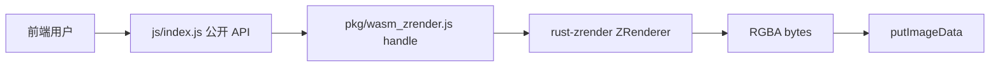

# wasm-zrender 多页文档重构

## 现状

当前权威文档只有一张页：[wasm-echarts-rs/site/zrender/docs/index.html](wasm-echarts-rs/site/zrender/docs/index.html)，把快速开始、字体、实例方法、图元、差异、架构全堆在一起。站点首页 [site/index.html](wasm-echarts-rs/site/index.html) 已有简短「项目缘由」，但产品入口是正文里的两张卡片，顶栏只有品牌、没有产品菜单。

站点本身已是 Vite 多页（[vite.config.js](wasm-echarts-rs/site/vite.config.js) 自动收集 HTML），新增子页即可进构建，不必上 VitePress。

公开入口是 `@wasm-zrender` → [crates/wasm-zrender/js/index.js](wasm-echarts-rs/crates/wasm-zrender/js/index.js)；`pkg/` 是 wasm-bindgen 内部 handle。文档必须以 facade 为默认用法，pkg 单独成章。

## 首页与全站顶栏（相对原方案的改动）

**起因介绍、三层定位不再放进 wasm-zrender 文档侧栏。** 它们属于整个仓库，写在站点首页。

改写 [site/index.html](wasm-echarts-rs/site/index.html)：

- 正文：**起因介绍**（用 WASM 实现 ECharts canvas 全能力、推广到不同语言平台；只渲染到 canvas 再把图像交回外部；因此不需要动画中间帧）+ **rust-zrender / wasm-zrender / wasm-echarts 作用与定位**（表格 + 关系图）。保留并收紧「已知限制」。
- **去掉「产品入口」卡片区**，不再在首页正文里放 wasm-zrender / wasm-echarts 双卡片。

全站顶栏统一（首页、zrender、echarts、文档、实例共用同一套）：

- 品牌 → `/`（首页）
- **wasm-zrender** → `/zrender/docs/`（当前产品高亮）
- **wasm-echarts** → `/echarts/docs/`

进入某一产品后，顶栏在产品名旁保留该产品的「文档 / 实例」（与现有 [zrender/index.html](wasm-echarts-rs/site/zrender/index.html)、[echarts/index.html](wasm-echarts-rs/site/echarts/index.html) 一致）。产品落地页 `/zrender/`、`/echarts/` 可保留为薄枢纽，但首页不再用卡片导流。

实现上抽一层共享顶栏（例如 `site/src/shared/site-header.js`），避免每页手写两套 nav。

## wasm-zrender 文档信息架构

`/zrender/docs/` 默认落在「快速上手」（不再是起因介绍）。左侧固定菜单，当前页高亮。API 参考再展开两级。

```
快速上手
字体引用
API 参考
  JS facade API
    总览与约定
    生命周期
    ZRender 实例
    Element / Displayable / Path / Group
    图元（Shape / Text / Image）
    样式与几何
    工具模块
    动画与事件
  pkg 导出 API
    总览与何时使用
    顶层函数与 ZRender
    图元与样式类
    空壳与不要直接用的符号
与官方差异
底层原理
```

落地目录（Vite 会自动收录）：

- [wasm-echarts-rs/site/zrender/docs/index.html](wasm-echarts-rs/site/zrender/docs/index.html) → **快速上手**
- `fonts.html`、`differences.html`、`internals.html`
- `api/index.html`、`api/facade/*.html`、`api/pkg/*.html`

侧栏是 zrender 文档专属；顶栏仍是全站产品菜单。文档页 import `docs-shell.js`（侧栏）+ 共用 `site-header`。

API 条目统一徽章，贯穿 facade / pkg / 差异三章：

- **官方** — 对齐 `zrender-master` 的 `export.ts` / `zrender.ts` / `Element.ts`
- **补充** — wasm-zrender 多出来的（`registerFont`、`refresh` 返回 RGBA、`init(null)` 等）
- **降级** — 签名在、语义弱于官方（动画终态、`morph`、`IncrementalDisplayable`、`configLayer`）
- **仅 facade** / **仅 pkg** — 只在其中一层存在

每个 API：参数表 + 一两句行为 + 很短示例（3–8 行）。示例优先链到现有实例页（`/zrender/examples/text.html` 等）。



---

## 各章写什么（权威口径，以源码为准）

### 首页：起因介绍与三层定位（`site/index.html`）

面向「为什么做这个仓库」，不是 zrender API 表。

- 目标：用 WASM 实现 ECharts 的 canvas 能力，把渲染内核做成可到其他语言平台的 Rust 库；浏览器只负责把图贴上 canvas（或拿回图像）。
- 因此不做动画中间帧：要的是一帧终态图像，不是 rAF 循环。
- 三层定位（对照 [AGENT.md](AGENT.md) 仓库总览）：

| 层 | 路径 | 给谁用 |
|----|------|--------|
| **rust-zrender** | `crates/rust-zrender` | 纯 Rust 引擎；无 wasm-bindgen；可 `cargo test` / 未来 Wasmer |
| **wasm-zrender** | `crates/wasm-zrender` | 对齐官方 zrender 图元 API；文档站与「直接构图」用户 |
| **wasm-echarts** | `crates/wasm-echarts` | 对齐官方 `init`/`setOption`；内部用同一份 `ZRenderer`，不经第二份 zrender wasm |

- 关系图：site → facade → pkg → rust-zrender；wasm-echarts 与 wasm-zrender sibling，echarts 页不得再加载 `wasm-zrender/pkg`。
- 正文不再放产品卡片；读者从顶栏进 wasm-zrender / wasm-echarts。首页可加一句链到 `/zrender/docs/`、`/echarts/docs/`。

### 1. 快速上手（`zrender/docs/index.html`）

讲清 **pkg 与 js facade 的分工**，再给最小可用路径。

- `wasm-pack build --target web` 产出 `pkg/`（胶水 + `.wasm`），**不是**给业务直接 import 的公开面。
- `js/` facade：原型链（`Rect instanceof Path instanceof Displayable instanceof Element`）、工具命名空间、包装 native handle。Vite alias `@wasm-zrender` 指向 `js/`。
- 推荐调用顺序：`await initWasm()` → `registerFont`（有文字时）→ `init(canvas)` → `add` 图元 → 有 DOM 时自动 `putImageData`；离屏用 `init(null, {width,height})` 再 `refresh()` 拿 RGBA。
- 两段完整示例：绑定 canvas；纯离屏 `putImageData`。
- 指向 [examples/](wasm-echarts-rs/site/zrender/examples/)。项目缘由只回链首页，不在本章复述三层定位长文。

### 2. 字体引用（`fonts.html`）

从现有「字体加载」节扩写，讲清 **Chrome 能画字、WASM 不能** 的原因。

- 浏览器：`ctx.font` 走系统/网页字体引擎。
- wasm-zrender：离屏 `vl-convert-canvas2d` + cosmic-text，**读不到 OS 字体**，也不把默认 TTF 打进 `.wasm`。
- 必调 `registerFont(bytes, { familyName?, sansSerif? })`；未注册 Text 会 `no default font found`。
- 调用顺序、热更新、`sans-serif` 映射规则、`Text.style.fontFamily`。
- site 辅助：[fonts.js](wasm-echarts-rs/site/src/zrender/fonts.js)（文档站便利，不是库 API）。
- 原生 Rust：`register_font`；wasm32 不加载系统字体。

### 3. API 参考（按层拆页）

**JS facade** 以 [js/index.js](wasm-echarts-rs/crates/wasm-zrender/js/index.js) 为唯一公开面。每条注明官方/补充/降级。

建议分页（避免再变成长文）：

- **总览**：导入方式、`default` 是 `initWasm`、构造约定（`super()` 不建 native，再 `_bindNative`）。
- **生命周期**：`init(dom?, opts?)`（`width/height/dpr`，dom 可 null）、`dispose`/`disposeAll`/`getInstance`/`version`/`registerPainter`（只记录，不切后端）、**补充** `registerFont`/`clearFonts`。
- **ZRender**：`add/remove/clear`、`refresh`/`flush`（**返回 RGBA，官方 void**）、`resize`、`findHover`、`on/off/trigger`、`setBackgroundColor`、`setCursorStyle`、`configLayer`（降级）、`painter` stub、`width()/height()/dpr()` 简写。
- **Element 系**：变换属性、`attr` 双参数、state、clipPath、`hide/show`；Group 子树 API（`children`/`eachChild`/`traverse` 等，**仅 facade**）；`Path.extend`。
- **图元**：各 Shape 的 `shape` 字段（`Rect.r`、`Sector.r0/clockwise/cornerRadius`、Line 默认 stroke 无 fill、Text 默认 fill `#000`）；`IncrementalDisplayable` 降级为 Group。
- **样式与几何**：`LinearGradient`/`RadialGradient`/`Pattern`（补充 `imageData/imageWidth/imageHeight`）；`Point`/`BoundingRect`/`OrientedBoundingRect`。
- **工具**：`matrix`/`vector`/`color`/`path`/`util` 按官方签名（实现在 `js/tool/`）；`morph`/`parseSVG`/`showDebugDirtyRect`/`setPlatformAPI` 降级。
- **动画与事件**：`Animator.when().start()` 终态；`Handler.dispatch`；有 canvas 时指针绑定。

**pkg 导出** 以 [src/lib.rs](wasm-echarts-rs/crates/wasm-zrender/src/lib.rs) / `#[wasm_bindgen]` 为准，明确写：

- 业务代码应走 facade；pkg 给调试、echarts 注入 native、或绕过原型链。
- pkg 的 `matrix()`/`vector()`/`color()` 等是**空对象占位**；有内容的实现在 JS tool。
- pkg `Element` 几乎只有 `id`/`type`；`Displayable`/`IncrementalDisplayable` 构造抛错；facade 的 `IncrementalDisplayable` 绑的是 `Group`。
- 列出与 facade 同名但语义不同的方法，以及 **仅 pkg** 符号。

参数表从源码核对，不从旧单页抄：facade 看 `js/*.js`，pkg 看 `src/zrender.rs`、`graphic/*.rs`、`bridge/shape.rs`、`font.rs`。

### 4. 与官方差异（`differences.html`）

三张表，禁止把「后置未做」写成「允许例外」。

**允许例外（仅四条）**：字体必须注册；动画终态；仅 canvas 离屏（无 SVG / hover layer / dirty rect）；`init(canvas|null)` 宿主。

**已对齐**：`export.ts` 类型与 `init/dispose/getInstance`、原型链、变换主属性、Group 子树、Shape 默认 style、clip/state/事件。

**降级 / 后置（未实现）**：`skewX/Y` `anchorX/Y`、`textContent` 自动布局、RichText、真实 morph、增量图层、`Path.extend` 走完整 PathProxy、conic gradient、CSS filter。

**补充 API**（不得当官方用）：`registerFont`/`clearFonts`、`refresh`/`flush` 像素缓冲、`init(null)`、`Pattern.imageData*`、`width()/height()/dpr()`、`disposeAll`、`handler.dispatch`。

### 5. 底层原理（`internals.html`）

给能读 JS、想搞懂 WASM 的前端，不写成 rustc 手册。三层定位只回链首页，本章聚焦引擎与桥。

- **rust-zrender 依赖**（[Cargo.toml](wasm-echarts-rs/crates/rust-zrender/Cargo.toml)）：

| crate | 为什么用 |
|-------|----------|
| `vl-convert-canvas2d` | 离屏 Canvas2D（tiny-skia + cosmic-text） |
| `tiny-skia` | 补官方有、vl-convert 无的 **阴影** |
| `kurbo` | 路径 winding / stroke **命中**（不靠浏览器 `isPointInPath`） |
| `csscolorparser` | CSS 颜色字符串 |
| `thiserror` | `BackendError` / `FontRegistryError` |

- 相对 vl-convert 的补齐：阴影、命中、径向渐变 `r0`、`lineDash` 字符串、Pattern 变换、字体热更新。
- 管线：`Storage` displayList（timsort zlevel/z/z2）→ `Painter`/`brush` → `get_rgba()`。
- **JS ↔ WASM**：
  - 普通数据：`bridge/opts.rs`、`shape.rs`、`fill_stroke.rs` 把 JS object 解成 Rust
  - 函数：`on/off/trigger` 把 `js_sys::Function` 存在 registry，命中后 `call1`
  - 图像：`Uint8Array` + 宽高、或从 `HTMLCanvasElement`/`HTMLImageElement` `getImageData`；URL 未 decode 则同步路径失败
  - 回图：`refresh()` → `Vec<u8>`；绑了 canvas 则 `ImageData` + `putImageData`（mousemove 默认不上屏）

---

## 同步改动

- 全站顶栏：品牌 + wasm-zrender + wasm-echarts；产品页/文档/实例共用
- [zrender/index.html](wasm-echarts-rs/site/zrender/index.html) 顶栏与首页一致，卡片文案改为「分章文档 + 侧栏」
- [echarts/index.html](wasm-echarts-rs/site/echarts/index.html) 只改顶栏产品菜单（echarts 文档正文本波不动）
- [AGENT.md](AGENT.md)「四、site」：首页 = 起因 + 三层定位；顶栏 = 产品入口；zrender 文档五章（上手 / 字体 / API / 差异 / 原理）
- [README.md](README.md)：首页介绍仓库定位；zrender API 仍指向 `/zrender/docs/`（现为快速上手）

不改示例运行时、不引入文档生成器。echarts 文档正文本波不动。

## 验收

- 打开 `/` 能读完起因、为何不做动画、以及 rust-zrender / wasm-zrender / wasm-echarts 分工；首页没有产品卡片
- 顶栏能切到 wasm-zrender / wasm-echarts（文档默认页），当前产品高亮
- `/zrender/docs/` 打开即见侧栏五章（从快速上手起），正文不再是单页全集，也不再重复首页长文
- 点 API → facade / pkg 分栏，每条有徽章 + 参数 + 短示例
- 字体页能独立讲清为何必须 `registerFont`
- 差异页能分清例外 / 未实现 / 补充
- 原理页能讲清 crates、补齐点和三种数据过桥
- `npm run build` 因自动收集 HTML，新页进入 `dist/`
