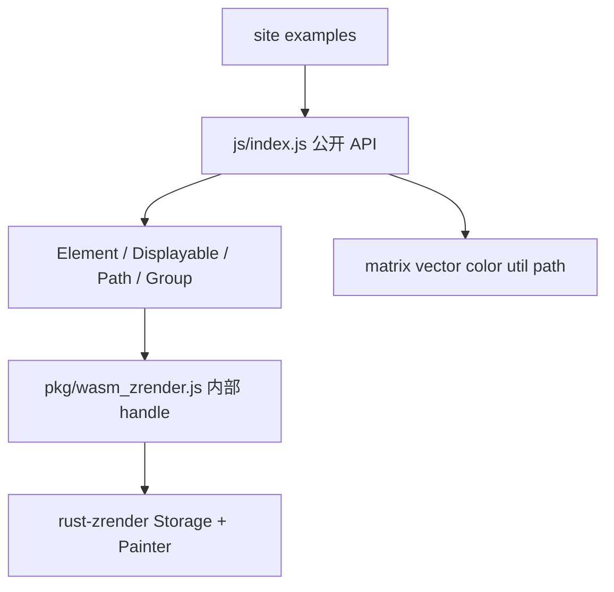

# zrender API 规范与逐项修复

对照源只读：[`zrender-master/src/export.ts`](zrender-master/src/export.ts)、[`zrender-master/src/zrender.ts`](zrender-master/src/zrender.ts)、[`zrender-master/src/Element.ts`](zrender-master/src/Element.ts)。禁止改官方目录，也禁止整文件复制官方实现（工具函数按签名重写）。

## 规范（先写入 AGENT.md）

在 [`AGENT.md`](AGENT.md)「目标与约束」和「wasm-zrender」两节改成硬规则，并在规划表里挂上本计划。规范正文只留可核对条目，细节以本计划为权威清单。

**允许例外（仅此四条）：**

- 字体：必须 `registerFont` / `register_font`，WASM 不读系统字体。
- 动画：不播中间帧；`animate` / `animateTo` / `when().start()` 立刻写入**最后一组**目标属性。
- 离屏：仅 canvas；`refresh()` / `flush()` 同步返回 RGBA；无 SVG painter / hover layer / dirty rect。
- 宿主：`init(canvas)` 可自动 `putImageData`；`init(null)` 仍用 opts 宽高。

**必须一致：**

- 公开入口与官方同构：`init` / `dispose` / `disposeAll` / `getInstance` / `version` / `registerPainter`，以及 `export.ts` 全部类型与 `matrix` / `vector` / `color` / `path` / `util` 命名空间。
- 图元原型链：`Rect instanceof Path instanceof Displayable instanceof Element`（Group 亦 `instanceof Element`）。
- 变换主属性：`x` `y` `scaleX` `scaleY` `rotation` `originX` `originY`；`attr` / `setShape` / `setStyle` 支持对象与 `key, value`。
- Group：`new Group(opts)`，以及 `children` / `childAt` / `childOfName` / `childCount` / `eachChild` / `traverse` / `addBefore` / `replace`。
- Shape 字段与官方默认 style（尤其 `Sector.r0`、`Rect.r`、Line 默认 stroke 无 fill、Text 默认 fill `#000`）。
- 实例生命周期：`zr.clear` / `zr.dispose` / `setBackgroundColor` / `trigger`；元素 `hide`/`show`、`on`/`off`/`trigger`、`clipPath`。

**明确仍后置（规范里写「本波不挡主路径」）：** `skewX/Y` `anchorX/Y`、`textContent` 自动布局、RichText、`morph` 形变、`IncrementalDisplayable` 增量语义、`Path.extend` 自定义 `buildPath` 走 PathProxy。这些单列波次，不混进「已对齐」。

同步改掉 AGENT.md 末尾「动画、事件总线明确不做」——事件已做且要补齐；动画改为终态语义。

## 架构：JS facade + rust 引擎

你已选 **手写 JS facade**。绘制与命中仍走现有 `wasm-bindgen` → [`rust-zrender`](wasm-echarts-rs/crates/rust-zrender)。

新目录 [`wasm-echarts-rs/crates/wasm-zrender/js/`](wasm-echarts-rs/crates/wasm-zrender/js/)：

- `index.js`：官方命名导出；`default` 仍是 `initWasm`。
- `element.js` / `displayable.js` / `path.js` / `group.js` / `text.js` / `image.js` / `shapes/*.js`：原型链；实例持有内部 native handle。
- `zrender.js`：包装现有 [`zrender.rs`](wasm-echarts-rs/crates/wasm-zrender/src/zrender.rs)。
- `tool/*.js`：按官方签名重写，**不是**空对象，也不是从 `zrender-master` 粘贴。

[`site/vite.config.js`](wasm-echarts-rs/site/vite.config.js) 的 `@wasm-zrender` 改为指向 `js/`；`js/index.js` 再 `import initWasm, * as native from '../pkg/wasm_zrender.js'`。示例改为 `from '@wasm-zrender'`，兼容旧路径可用再导出一层。

构造约定：子类 `super()` 不创建 native，再 `_bindNative(new native.Rect(opts))`。JS 侧维护 `x/y/scale*` 与 Group `_children`，变更时同步 rust（[`Transform`](wasm-echarts-rs/crates/rust-zrender/src/element/transform.rs) 已有 scale/rotation/origin，缺的是 wasm 接线）。

## 逐项波次

每波：改 rust（若需要）→ 改 facade/桥 → 补测试 → 更新 AGENT.md 完成度。做完一波再开下一波。

### 波次 0 — 规范落盘

把上节写入 AGENT.md；本计划作为清单。

### 波次 1 — facade 骨架

- JS 原型链可 `instanceof`。
- 现有方法委托到 native，site 示例不回归。
- `version = '6.1.0'`（目标官方表面）；`registerPainter` 仅记录，非 canvas 忽略。

### 波次 2 — 变换 / attr / Group

- 解析并暴露 `x` `y` `scaleX` `scaleY` `rotation` `originX` `originY`（构造 + getter/setter + `attr`）。
- `new Group(opts)`；子树 API 在 JS 维护并同步 [`registry.rs`](wasm-echarts-rs/crates/wasm-zrender/src/registry.rs)。
- `setShape` / `setStyle` 双参数形式；`attr` 覆盖 shape/style/变换/z/silent/ignore/draggable/name/clipPath。

### 波次 3 — 画出来就错的字段（rust 先补）

引擎：

- [`sector.rs`](wasm-echarts-rs/crates/rust-zrender/src/graphic/shapes/sector.rs)：补官方 `r0` / `clockwise` / `cornerRadius`，去掉或忽略非官方 `percent`。
- [`rect.rs`](wasm-echarts-rs/crates/rust-zrender/src/graphic/shapes/rect.rs)：`shape.r` 圆角。
- [`polygon.rs`](wasm-echarts-rs/crates/rust-zrender/src/graphic/shapes/polygon.rs)：`smooth` / `smoothConstraint`（对照官方 `graphic/helper/poly.ts` 行为重写）。
- Line 默认 `fill: none, stroke: #000`；Text 默认 fill `#000`。
- [`style.rs`](wasm-echarts-rs/crates/rust-zrender/src/graphic/style.rs)：`miterLimit`；`lineDash` 接受 `'dashed'` / `'dotted'`。

wasm [`bridge/shape.rs`](wasm-echarts-rs/crates/wasm-zrender/src/bridge/shape.rs) 与 facade 同步解析。`LinearGradient.addColorStop`；`RadialGradient` 构造可设 `r0`。

### 波次 4 — 工具模块

在 `js/tool/` 实现 `matrix` / `vector` / `color` / `util` / `path`（`createFromString` 可落到已有 `Path` + `pathData`）。`morph` / `parseSVG` / `showDebugDirtyRect` / `setPlatformAPI` 先做签名齐全的最小实现：`parseSVG` 能解析基本 path；`morph` 直接返回终点 path（符合动画例外）。

### 波次 5 — 动画终态 + ZRender 生命周期

- [`animation.rs`](wasm-echarts-rs/crates/wasm-zrender/src/animation.rs) 或 JS `Animator`：记录 `when` 最后一帧，`start()` 写回 `shape`/`style`/变换。
- `zr.clear` / 实例 `dispose` / `setBackgroundColor` / `getBackgroundColor` / `trigger`。
- `el.hide` / `show`（接到 rust `ignore`）；`el.off` / `trigger`；`zr.off(name, handler)` 按函数取消。
- 更新 [`animation.js`](wasm-echarts-rs/site/zrender/examples/animation.js)：圆应停在最后 `when` 的 `cx`。

### 波次 6 — 其余官方方法

- `getClipPath` / `removeClipPath`；clip 扩到 Group/Text/Image（引擎若只支持 Path clip，Group clip 对子树生效）。
- `useStates` / `getState` / `ensureState` / `clearStates`。
- `zr.setCursorStyle`；`configLayer` 可先 no-op + refresh。
- `Path.extend`：JS 子类 + 把 `buildPath` 录成 PathProxy/PathData。
- `IncrementalDisplayable`：先按普通 Group 语义落地，避免构造抛错。
- Point 静态方法、`BoundingRect.calculateTransform`。

## 测试与文档

- rust：`cargo test -p rust-zrender`（Sector 环、圆角 Rect）。
- wasm：现有 `wasm-pack test --node` 不因 facade 改名而红。
- 新增 JS 验收（site 示例或小测试页）：`new Rect() instanceof Path`、`new Group({x:10}).x === 10`、`matrix.mul`、动画终态。
- 改完同步 [`AGENT.md`](AGENT.md)、site [`docs/index.html`](wasm-echarts-rs/site/zrender/docs/index.html)、README 的导入路径与例外列表。
