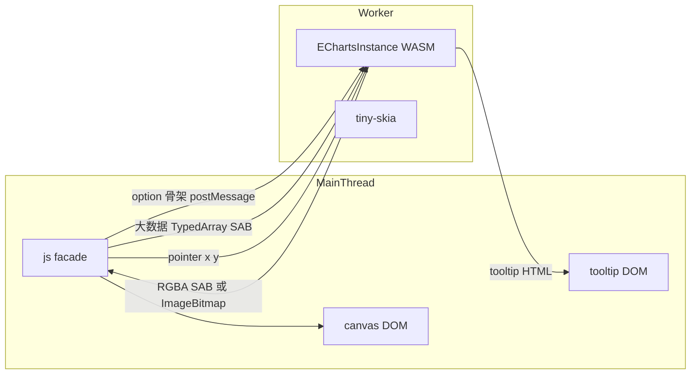

# 示例独立脚本 + Worker 封装判定

## 先回答：两种 Worker 方案哪个更好

**更好的是：把 Worker 封装进 JS facade，开发者感受不到。** 不要让每个示例亲手 `new Worker`。

原因（和本仓库硬规则一致）：

- 公开 API 要对齐官方 `init(canvas)` / `setOption` / `on`。Worker 是实现细节，不是产品 API。
- 画廊里约 300 个官网同步示例，若每页都写 Worker 样板，开发者学到的是「wasm-echarts 特有用法」，和官方文档对不上，也比 [pie.js](wasm-echarts-rs/site/echarts/examples/pie.js) / [hello_world.js](wasm-echarts-rs/site/zrender/examples/hello_world.js) 更难读。
- 指针、tooltip DOM、`resize`、`getZr()` 必须留在有 DOM 的主线程。这些协议该由 facade 做一次，不该复制 300 份。
- **不能**把「所有示例改成 Worker 文件」当成默认：小饼图不需要；`formatter` / `renderItem` 等函数 **不能** `postMessage` 结构化克隆。WASM 必须和定义这些函数的 JS 在同一个 realm。用户在主线程 `setOption({ formatter(){} })`、WASM 却在 Worker 里，回调桥会断。

例外：大数据示例（`bar-large` / `scatter-large`）才值得走 Worker；普通示例继续主线程即可。

### 方案 A：开发者自己管 Worker（不推荐做默认）

页面只负责 canvas、收位图、转发鼠标：

```javascript
// page.js
const worker = new Worker(new URL('./chart.worker.js', import.meta.url), { type: 'module' });
worker.postMessage({ canvas: offscreen }, [offscreen]);
canvas.onmousemove = (e) => worker.postMessage({ type: 'move', x, y });
worker.onmessage = (e) => { /* 显示 tooltip HTML */ };
```

```javascript
// chart.worker.js
import initWasm, { init } from '@wasm-echarts';
await initWasm();
const chart = init(null, null, { width, height });
chart.setOption(option);
postMessage({ rgba: chart.refresh(), width, height });
```

优点：函数 option 写在 worker 里就能用；主线程几乎不卡。  
缺点：每个示例两套文件；`on('click')`、`getZr()`、`connect` 都要自己桥；和官方用法差最远。

### 方案 B：封装进 facade（推荐）

开发者写法仍接近官方、也接近现有手写示例：

```javascript
import initWasm, { init, registerFont } from '@wasm-echarts';
await initWasm();
registerFont(fontBytes, { familyName: 'Noto Sans SC' });
const chart = init(canvas); // 默认同线程
chart.setOption(option);
chart.on('click', (p) => console.log(p));
```

大数据时加开关，仍不必自己管 Worker：

```javascript
const chart = init(canvas, null, { useWorker: true });
await chart.setOption(option); // 内部 postMessage，画完再 putImageData
```

内部：Worker 持有 `EChartsInstance`；主线程 facade 绑 DOM 事件、tooltip、把 `x,y` 转进去、把 RGBA/`ImageBitmap` 贴上 canvas。`formatter` 随 option 进不了 Worker 时，文档写清：Worker 模式仅支持可克隆 option，或把回调留在主线程（默认路径）。



---

## 整改 1：去掉 `runOfficialExample` 代管（建议先做）

[official-runtime.js](wasm-echarts-rs/site/src/echarts/official-runtime.js) 现在既 **init/setOption/报错/resize**，又提供官网沙箱变量 `ROOT_PATH` / `$` / `app`。后者官网源码会用，前者才是「看不懂怎么用」的根源。

目标形态对齐手写 [line.js](wasm-echarts-rs/site/echarts/examples/line.js)：每个 `examples/*.js` 自己 `initWasm` → 字体 → `init(canvas)` → `setOption`。

仍允许一个**很薄的 env 模块**（改名，不再叫 runtime），只导出官网示例需要的环境，不创建图表：

- `ROOT_PATH` / `CDN_PATH`
- `$.get` / `getJSON` / `getScript` / `when`
- 可选：`sizeCanvas`、`showPreviewError`

同步脚本 [sync-official-examples.mjs](wasm-echarts-rs/site/scripts/sync-official-examples.mjs) 的 `wrapOfficialSource` 改成生成完整脚本，而不是 `runOfficialExample(async ({ myChart }) => ...)`。官网 option 正文仍原样嵌入（不改官方 option）。

probe 现在读 `window.__OFFICIAL_EXAMPLE_RESULT__`，改成示例末尾同样 `postMessage` / 挂结果，或 probe 改为看 canvas 是否画出像素 + `.preview-error`。

---

## 整改 2：Worker（不要把 300 页都改成 worker 文件）

不要「所有示例 = 一个 worker.js」。那样既吵又和函数型 option 冲突。

正确落地顺序：

1. facade 增加可选 `opts.useWorker`（默认 `false`，保持现有同步 `setOption`）。
2. Worker 内 `initWasm` + `EChartsInstance`；主线程只 blit + 事件 + tooltip。
3. 先接 1～2 个会卡死的示例：`bar-large` / `scatter-large`，验证页面不再无响应。
4. 文档四块写清：默认主线程；Worker 是例外；不可克隆的 function option 限制。
5. 普通官网示例继续主线程独立脚本即可。

WASM 侧短期内不必为 Worker 改绘制内核；要改的是 **JS 把实例放到哪个全局**。`set_option` 仍是 Worker 线程上的同步长任务，主线程才能活。这和「分片 progressive」是另一条线，本轮不做。

---

## Worker 传输规范：SharedArrayBuffer

**结论：整份 option 不要塞进 SAB；大数据 TypedArray 和像素回传要用 SAB（或同级的 Transferable）。** 这是 Worker 路径的硬规范，落地时写入 [AGENT.md](AGENT.md)。

`postMessage` 结构化克隆会把 `scatter-large` 那种 `Float32Array`（约 50 万点 × 2 系列）和整幅 RGBA 再拷一份。绘制已经很重，再拷一遍纯浪费。SAB 让主线程和 Worker 看同一块内存，避免这次拷贝。

**不要用 SAB 装整个 option。** option 是嵌套对象 + 字符串 + 函数，SAB 只是字节缓冲。塞进去等于先自己做一遍序列化，函数照样过不去，比 `postMessage({ title, series, ... })` 更差。

规范：

- option **对象骨架**（title、series.type、axis、不可克隆的元数据）继续 `postMessage`。
- `series.data` / `dataset.source` 里体积大的 `TypedArray` / `ArrayBuffer`：优先写入 **SharedArrayBuffer**（或 `postMessage(..., [buffer])` 转移所有权）。`scatter-large` 的 `Float32Array` 走这条，不要 structured clone。
- 回图：Worker 把 RGBA 写进 **预分配的 SAB**（可双缓冲，避免每帧 `new Uint8Array`）；主线程 `ImageData`/`putImageData` 或 `drawImage(ImageBitmap)`。单帧一次性也可以 `Transferable ArrayBuffer` / `ImageBitmap`。能 `transferControlToOffscreen` 时优先 OffscreenCanvas，主线程不再拷像素。
- 站点要 **Cross-Origin Isolation**（`Cross-Origin-Opener-Policy: same-origin` + `Cross-Origin-Embedder-Policy: require-corp`），否则 `SharedArrayBuffer` 不可用。Vite / 文档站必须配这两个头。不可用时 **fallback 到 Transferable ArrayBuffer**，不要静默再走结构化克隆拷大数据。
- 同线程 `init(canvas)` 默认路径不强制 SAB；这是 Worker 过界传输规范，不是改公开 `setOption` 签名。

相对收益：传 50 万点 × 8 字节、或 800×600×4 的 RGBA，SAB/Transferable 能省掉一次完整 memcpy。省不掉的是 Worker 里 WASM 解析和 tiny-skia 绘制。

---

## 文档

同步 [AGENT.md](AGENT.md)：示例不再经 `runOfficialExample`；`init` 的 `useWorker`；与官方不一致表加 Worker 函数 option 限制；Worker 大数据 TypedArray / RGBA 用 SharedArrayBuffer（需 COOP/COEP，失败则 Transferable）。
